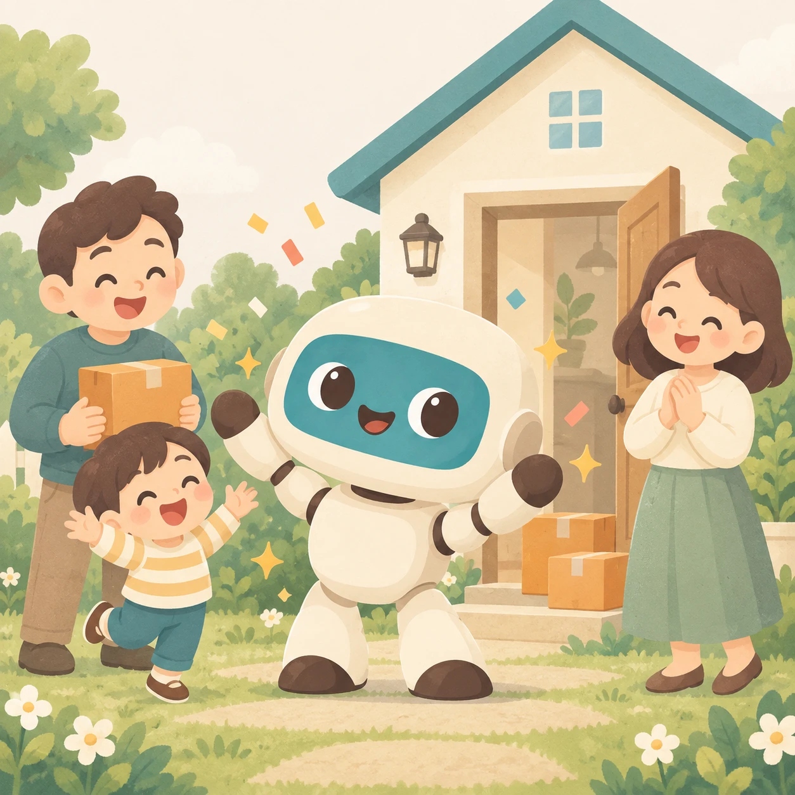

# 全面クリア画面 — 他アプリ担当者向けメモ

2026-09-27。発案者指定の構成は **一枚ものの絵＋メッセージ＋短い音楽＋ボタン類**。デリバリズムで実装・公開済み。他アプリへ展開するときの参考とする（他アプリへの実装はまだ行っていない）。

## 画面の構成

| 要素 | デリバリズムの実装例 |
|---|---|
| 達成表示 | 「やさしい／むずかしい・ぜんぶの レベル クリア！」 |
| 見出し | 「ぜんぶ とどけた！」 |
| 一枚絵 | ロボットと配達先の家族が喜ぶ、承認済みの絵。画像全体を表示し、切り抜かない |
| メッセージ | 「ありがとう！」「みんなに えがおが とどいたよ。」 |
| 音楽 | 約4.72秒の柔らかい旋律＋和音。画面表示時に一度だけ再生 |
| 主ボタン | 「タイトルへ」。音楽中でも押せる。自動では画面を閉じない |
| ヘッダー | 既存の終了・ヘルプ・マイクボタンを維持 |
| 音声案内 | 音楽中はタッチ案内。終了後は「オッケー／おわり」でタイトルへ戻れる |

## 表示条件・動作

- 通常の面クリアやレベルクリアとは別の、全体達成の画面。最後の結果画面で「つぎ」を押すと進む。
- デリバリズムは**同じ難易度の全4レベル**のクリア記録が条件。順不同でもよい。レベル4だけの直接クリアでは表示しない。全達成後のレベル4再クリアでも表示する。練習・自作面は対象外。
- 音楽中は音声認識を停止し、終了後に再開。タイトルへ戻る・ヘルプ・画面離脱では予約音と待機を取り消す。
- 保存からの再開では絵を復元するが、音楽を勝手に再生しない。クリア記録はタイトルへ戻っても保持する。
- スマホで絵・文言・ボタンを1画面に収める。画像はオフライン用キャッシュにも含める。

## 参照するソース

| 内容 | ファイル・入口 |
|---|---|
| 画面・配置 | [delivery/index.html](../delivery/index.html) の `#ending`、[delivery/styles.css](../delivery/styles.css) の `#ending`／`.ending-art` |
| 遷移・音声・音楽の開始停止 | [delivery/app.js](../delivery/app.js) の `showResult` → `nextStage` → `showEnding`、`syncVoice`、`stopAsync` |
| 全達成判定 | [delivery/run.js](../delivery/run.js) の `allLevelsCleared` |
| 保存 | [delivery/storage.js](../delivery/storage.js)。任意の真偽値 `allClearReady`／`endingShown` |
| 音楽 | [delivery/sound.js](../delivery/sound.js) の `scoreFor('allClear')`。端末内Web Audio合成、ループなし |
| 画像 | [配信用WebP](../assets/delivery/all-clear.webp)／[承認済みPNG原本](../assets/delivery/originals/all-clear.png)／[制作記録](delivery/assets.md) |
| 検証 | [全面クリア検証](../scripts/test-delivery-ending-browser.cjs)／[オフライン検証](../scripts/test-delivery-offline-browser.cjs) |

他アプリでは、その作品のキャラクター・世界観に合う絵とメッセージを用意し、実際の全達成条件に接続する。デリバリズム固有の「4レベル」や保存項目をそのまま共通仕様にしない。既存のタイトル・音声入力・記録を作り直さず、上記の構成と停止制御を参考にする。

実装状況と検証の詳細は [デリバリズム実装記録](delivery/implementation-log.md) の2026-09-27節。実機での音量・聞こえ方は別途確認が必要。
