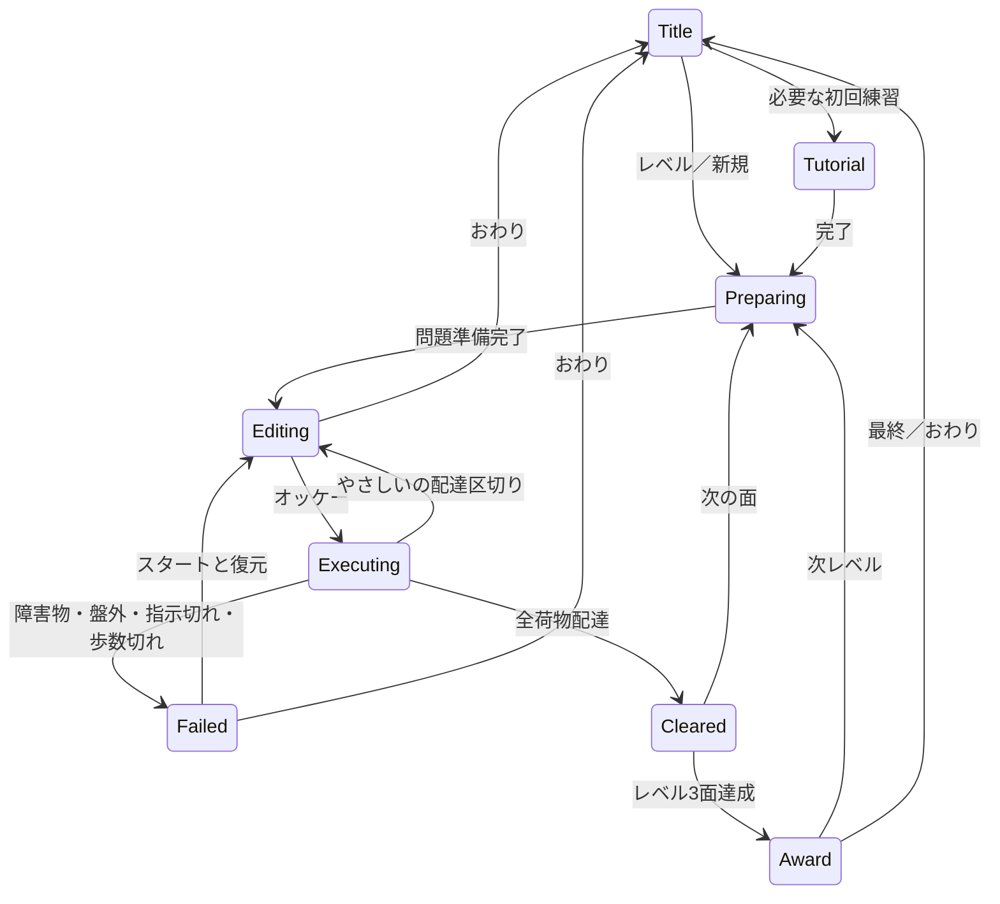

# デリバリズム 基本設計

版：0.3／2026-09-26。要件正典：[requirements-robot.md](../requirements-robot.md) v0.36。状態：ローカル実装・自動検証済み、実機受入・公開は未実施。[実装記録](implementation-log.md)を現在状態の正典とする。以下の設計時の予定は同記録と照合する。

## 1. 設計の範囲と前提

既存コエキットへの増分設計。HTML/CSS/ES Modules・ビルドなし・既存PWAを継承する。サーバー、認証、追加ライブラリ、外部音声送信は導入しない。共有はRB-007の後続範囲で、初版に共有ボタンや公開URLを作らない。

印なしのゲームルールは合意済み要件、【設計】は要件を満たす技術判断、【想定】は初期調整値、【要確認】は発案者の判断を要する案。D-Q01〜03は2026-09-26に確定した判断記録。残る表示案・調整値は実装と試遊で具体化する。

### 実装者への指示

- 共通制約は[実装ガイド](../implementation-guide.md)を正典とし、既存作品を作り直さない。
- 認識確定→指示表への表示→オッケーで実行。認識途中のpartial結果を追加しない。行追加だけでは動かさない。
- 音声は受付区間だけ開始。移動演出・効果音中は停止。マイクOFF／拒否でも全操作をタッチで完結させる。
- 易しい／難しいの再挑戦地点と歩数返却を統一しない。配達後の指示消去は易しいだけ。
- イロドリズムの数字単独による位置補完を指示入力へ持ち込まない。数字だけ・複数指示を途中まで受け付けない。
- 移植元コロガリズムには書き込まない。探索を障害物セルに適応し、境界壁方式を持ち込まない。
- 既存共通部品の拡張は後方互換にし、全4作品の回帰を確認する。

## 2. 現行実装の確認と再利用

| 実在する参照先 | 確認内容・利用方針 |
|---|---|
| `src/speech/index.js`・`src/ui/mic-toggle.js` | 共通ファクトリとON/OFFを使用。方式Aを新作だけ許す分岐は作らない |
| `src/ui/voice-guide.js`・同CSS | 受付可能な操作を常設。非受付時に発話を促さない |
| `kioku/index.html`・`src/ui/levelselect.js`・`menu-controls.css` | タイトル、レベル選択、ホーム／ヘルプの構成を踏襲 |
| `irodori/board.js` | 座標変換・範囲判定は再利用候補。描画は色パレットと結合しているため、そのまま配達盤面へ転用しない |
| `irodori/storage.js` | 保存失敗でも既存値を残すパターンを参照。作品上限12件・キーを流用しない |
| `jintori/storage.js` | 保存値の検証・ルール版の確認方法を参照。対戦のモードキーは転用しない |
| `src/ui/achievement.js` | `medalMarkup`で既存メダルを再利用。`renderAward`は既存Progressへ結合しているためアダプタか後方互換拡張が必要 |
| `src/game/progress.js` | 既存称号名とゲーム一覧は固定。新作の4称号・難易度別記録をそのまま渡すだけでは成立しない |
| `src/ui/screenawake.js` | プレイ時の画面維持を共通化。失敗してもゲーム継続 |
| 要件書のコロガリズム確認節 | DFS/BFS/乱数の移植元。既存10テスト成功は前工程の記録であり、新作の正しさの証拠ではない |

本設計ではコードの読取のみ。新作のコード、画面、音声精度、生成性能は未検証。現行作業ツリーの `src/speech/vosk.js` 等の作業中変更には手を触れない。

## 3. 構成・処理インターフェース

【設計】新規公開パスは `delivery/`。実装時に初めて入口を追加する。以下は予定ファイルで、まだ存在しない。

| モジュール | 責務 |
|---|---|
| `delivery/index.html`, `styles.css`, `view.js` | DOM、盤面、指示表、結果、ダイアログ。ルール判定を持たない |
| `app.js`, `phase.js` | 状態遷移と音声受付、イベント世代、非同期取消 |
| `commands.js` | 1発話を1コマンドへ変換、語彙テーブル |
| `rules.js` | 純粋関数による1歩・拾得・配達・成否判定 |
| `run.js` | 3面進行、難易度別checkpoint、再挑戦、称号更新イベント |
| `solver.js`, `generator.js`, `search-worker.js` | 全配達の最短探索、生成、ヒント。画面をブロックしない |
| `storage.js` | 版付き保存・検証・エラー結果、終了後の再保存防止 |
| `editor.js` | 下書き・複製・削除・並べ替え・試遊への往復 |
| `config.js`, `tutorial.js` | 4レベル、調整値、固定練習、称号・メダルデータ |

処理境界は `parseUtterance(raw, context) -> Command | Error`、`editSequence(state, command)`、`step(stage, state, dir) -> {state, events}`、`solve(stage, state) -> {status, minSteps, path}`、`generate(seed, level, config) -> Stage | Error`、`save(key, value) -> {ok, code}`。外部APIはない。処理エラーコードを表示文言から分離する。

## 4. 画面と操作

デザイントークンの正典は[共通画面定義](../screens.md)。フォントは自前配信の `"M PLUS Rounded 1c", "Hiragino Maru Gothic ProN", "Yu Gothic UI", "Meiryo", sans-serif`。既存の暖色背景・大きなボタン・SVGを継承し、新たなアイコンライブラリを導入しない。アイコンのみの操作にaria-labelを付ける。画像は縦横比を維持し全体表示。基本16px／行間1.6、主要操作48px以上を基準に実DOMで検証する。

| ID | 画面・入口 | 表示／操作 | 次・戻る・空／エラー |
|---|---|---|---|
| D-S01 | タイトル：トップから | 参考画像に合わせたロゴ、難易度切替、最高メダル、つづきから、はじめから、4レベルの縦一列ボタン、つくる・あそぶ、練習はヘルプ内 | 未保存なら続きなし。ホームでトップへ。難易度で称号・クリア印を切替 |
| D-S02 | タイトル内の直接レベル選択 | 全4レベル、サイズ・荷物数・クリア✓。独立した選択画面は置かない | 選択→未受講練習→生成→編集。未達でも全レベルを選べる |
| D-S03 | 指示編集／確認 | 上：配達数・所持2枠・歩数、中央：盤面、下：指示表と方向／歩数／追加、もどす・やりなおし・ヒント・オッケー | 行タッチ／「2ばん」で置換。途中挿入なし。空の列は実行不可。おわり→途中保存消去→タイトル |
| D-S04 | 実行 | ロボットの1歩、実行中行の強調、荷物更新 | 正常配達→易しいは編集、難しいは継続。失敗→D-S05、完了→D-S06。タッチ終了可 |
| D-S05 | 失敗 | 失敗箇所と理由、スタート／おわり | スタート→復元後の編集。自動実行しない |
| D-S06 | 面／レベルクリア | 最終盤面と常設のトースト風完了パネル。「つぎ」。3面目はメダル＋称号。レベル4は達成表示 | 「つぎ」のタッチ／発話で次面／次レベル／タイトルへ。自動では進めない。最終レベルだけで下位をクリア扱いにしない |
| D-S07 | チュートリアル | 同じ盤面上で1項目ずつ案内 | 初回受講必須、以降スキップ可。完了後は元の開始先、再受講はタイトルへ |
| D-S08 | 自作面一覧 | 最大10枚のプレビュー、下書き表示、新規・編集・複製・削除、プレイ順を選ぶ | 0枚なら作成へ。10枚時の追加・複製は拒否し既存編集を案内 |
| D-S09 | エディタ | サイズ、ロボット・届け先・荷物・障害物の配置、最低歩数、上限＋／−、保存、試遊 | 未完成でも保存。解なし／探索中は試遊不可。戻る→一覧、試遊後は元の編集状態 |
| D-S10 | 自作面の順番 | 選択順の番号、上へ／下へボタン（ドラッグ必須にしない） | 完成面を並べ開始→D-S03。0面では開始不可。取消→一覧 |

スマホは盤面と主要操作が見える配置を優先。長い指示表は独立スクロールで編集中の行を追従し、全体を縮小して読めなくしない。PCは盤面と表を左右配置可能。320×568、390×844、768×1024、1280×800で枠接触・重なり・ダイアログ外へのボタン流出を検証する。9×9エディタの細かい選択は拡大盤面と座標表示で補助する。モックの承認を実画面検証の代用にしない。

### 音声受付表

2026-09-26試遊反映：歩数プルダウンは一辺−1（最大2/4/6/8）。方向矢印は同一SVGの回転、終了アイコンは実装中ジントリと同形。凡例はアセット付き14〜16px。高さ740px以下のプレイは盤面と指示表を左右に置き、説明・マイク案内込みでページの縦横スクロールを検証する。長い指示表は内部スクロールする。速度は開始待ち400ms・1歩750ms・途中配達1200ms・ゴール直前のタメ250ms（最後の移動・受け渡しと音を同期）・終端音開始後2200msを初期調整値とし、音の終了前には受付を再開しない。

| 区間 | 操作 | タッチ代替 |
|---|---|---|
| 編集 | みぎN／ひだりN／うえN／したN、Nばん、もどす、やりなおし、ヒント、オッケー、おわり | 方向と数の選択＋追加、行選択、各ボタン |
| 実行・効果音 | 受付停止。後から届いた結果も世代で棄却 | おわりは可能 |
| 失敗 | スタート、おわり | 再挑戦／終了 |
| 成功・称号 | つぎ／オーケー／オッケー、おわり（効果音終了後） | 次へ／終了 |
| ヒント／説明 | 専用受付。案内を進めるOKでゲームを実行しない | 次のヒント／閉じる／進む |

【設計案】エディタはイロドリズムの座標入力＋配置種類＋確定を再利用し、タッチはセル選択＋配置で操作。行番号と座標語彙を同時に受け付けない。A/E/Hの検証済み候補と数字単独の移動禁止を継承する。エディタの登録語は実装前に一覧化し実機確認する。

同じ発話内容を文字列だけで重複排除しない（「みぎ1」を2回言えば2行必要）。受付世代とイベントIDで二重配信だけ防ぐ。一息に2指示が認識された場合は全体を拒否し「ひとつずつ おねがい」を表示。音響的な発話区切りは実機で検証し、認識器による分割を完全に防げるとは保証しない。

### キャラクター・サウンド（RB-014）

採用はB案二足歩行。0個＝両手空、1個＝片手、2個＝両手持ち。描画はheldMaskのbit数から導出し、独立した所持カウンターを増やさない。荷物表示は回収・配達・checkpoint復元・途中再開で同時に更新。上部2枠は小さい盤面の視認補助として維持する。ロゴは共通ズムを再利用し、キャラクターを小品の独立アイコンにはしない。

SE・ジングルは必須、移動音の方向は「ピコピコピコ」。以下は音作りの初期案であり、試聴して調整する。

| イベント | 音の案 | 再生制御 |
|---|---|---|
| ロボット移動 | 軽く丸い短音をピ・コ・ピ・コと交互に鳴らす | 1歩のタイミングに同期。待機中のループはなし |
| 荷物回収 | 短い上昇音 | 新しく拾ったときだけ。満杯通過で回収音は鳴らさない |
| 配達 | 明るい着地音 | 手ぶら通過では鳴らさない |
| 失敗 | 柔らかな下降音 | 威圧的な警報音にしない |
| 面クリア | 短い達成ジングル | 最終配達音と重ならないよう一体化 |
| レベルクリア | メダル演出に合わせた少し華やかなジングル | 面クリア曲との二重再生を避ける |

【設計】`delivery/sound.js`でイベントと音を対応付ける。既存 `src/audio/sfx.js` はWeb Audio合成・primeAudio・stopAllの実装を参照し、他作品の音色や音量を変更しない。新作で追加した音源も一括停止の対象にする。初回タッチで音を有効化し、再生拒否・端末ミュートでも進行と表示は維持する。

移動・SE・ジングル中は音声認識を停止し、曲の終了後に現在区間の受付を再開する。終了・画面非表示では予約音を止め、古い音の終了通知で認識を復活させない。入力中の負数表示に警告音は付けない。音量、耳障りさ、実機での音声認識への回り込みを確認する。再開・再描画だけでは回収／配達音を重複再生しない。

## 5. 状態遷移・ルール

全プレイ状態からタッチ終了、受付中から音声終了が可能。終了では認識・音・タイマー・探索を停止し世代を更新する。状態変更は単一dispatchに集約し、次へ連打や古いWorker応答で二重進行しない。

1歩の処理順：残り歩数確認→上下左右の範囲・障害物検査→座標更新／1歩加算→空きがあれば拾得→届け先で所持分を配達→全配達判定→配達区切り判定→次の指示。上限ちょうどの最終配達は成功を優先。壁衝突では座標を動かさない。失敗の歩数は再挑戦時に合意したcheckpointへ戻る。

| 条件 | やさしい | むずかしい |
|---|---|---|
| 配達、未完了 | 指示残りを破棄して編集。checkpoint更新 | 指示の続きへ |
| 2個所持で荷物通過 | 残して通過、いっぱい表示 | 同じ |
| 手ぶらで届け先通過 | 続行 | 同じ |
| 全配達 | 即成功、余剰指示を実行しない | 同じ |
| 失敗→スタート | 最後の配達後へ復元、失敗区間の列を保持 | ステージ初期へ復元、列を消去 |
| 失敗の歩数 | checkpoint時点へ返却 | 0へ返却 |
| 未認識／不正な入力 | 列を変えず失敗にも数えない | 同じ |

【確定 D-Q01】入力中は `stepLimit - usedSteps - sum(sequence.count)` を常設表示し、追加・置換・取消・全消去で再計算する。負数は赤系と「−2歩（2歩オーバー）」で示す。超過アラートを出さず、列を保持しオッケーも有効とする（空列等の別条件は従来通り）。自分で気づき、実行して確かめられることが目的。表示名は「入力できる のこり」、実行中は「のこり ほすう」に切り替え、実行中は `stepLimit - usedSteps` のみを表示して予約分を二重に引かない。上限に達して未完了なら停止し「ほすうが たりなかった」。上限以内の全配達なら成功して余剰指示を捨てる。

【設計案】ヒントは現在の実位置・荷物状態からの全配達解で次に起こる回収／配達を目的地にする。2段階目はその解の先頭1歩。入力列の予測経路を描かず自動修正もしない。「ヒント」再入力で段階を進め、閉じるはヒント内のOK／ボタン。編集／配達／再挑戦で表示をリセットする。選んだ別ルートを誤答にしない。

## 6. 探索・生成・最低歩数

【設計】盤面は0-basedセルindex `row * size + col`。通行は範囲内かつ障害物でない上下左右のみ。拾得・配達を含めた探索状態は `(position, heldMask, deliveredMask)`。荷物は最大4個、未回収は全荷物集合から所持・配達済みを引く。所持と配達済みは互いに素、所持bit数<=2。移動は常に1コスト。

BFSで全荷物配達までの最短歩数を求める。最大81セル×3^4状態を上界の目安とし、visit済み状態を再探索しない。拾得自動・満杯なら残す・手ぶら通過は本番と同じstep関数を使用。参考となる独立した小盤面総当たりテストも用意し、共有関数のバグを見逃さない。成功0／解なし／取消／処理失敗を区別する。エディタで解なしを最低歩数0と表示しない。

難易度の配達区切りは編集タイミングだけで、歩行コストは変わらない。最短探索は全配達を対象に行う。ヒントでは現在状態と残り予算から到達可能性を確認する。

生成はseed付き乱数→セルの通路候補をDFSで作成→ロボット／届け先／荷物配置→実際の上下左右グラフを検証→荷物状態BFS→歩数上限算出。コロガリズムの境界壁データを単純に削除しただけの盤面は使わない。

序盤は始点・荷物・終点の単純な道を作り、別セルの隣接で近道が生じないか確認。複数ルート段階は通れるセルを追加し、必要地点への異なる経路が実際に存在するか確認する。不要領域の輪だけで複数ルート達成としない。

【想定・調整値】`generationAttempts=100`、Workerタイムアウト5秒。上限到達時は案内と再生成／タイトルへの戻りを用意する。解なし盤面を黙って出さない。最低歩数に加える余裕はeasy/ hardとレベル別のconfigに置き、初期調整案はeasy `ceil(min*0.5)`、hard `ceil(min*0.15)`。数値は実機試遊で確定し要件の合意済み値とは扱わない。

自作面はレベル生成を通さない。配置変更で解析revisionを増やし、古い探索結果は捨てる。保存上限は最短未満にしない。配置変更で旧上限が最短未満になった場合は不足表示と修正を要求し、未解決でも下書き保存は可能。プレイ開始前に再検証する。

## 7. データ・永続化

【設計】localStorageへ小さいJSONを保存し、音声やモデルは保存対象に含めない。用途別キーで終了時の削除範囲を限定する。schemaVersion/rulesVersionを確認し、未知版・破損を無条件に全消去しない。

| データ | 必須項目・型 | 不変条件 |
|---|---|---|
| Stage | id:string, revision:int, size:3/5/7/9, blocked:int[], start:int/null, destination:int/null, packages:{id,cell}[], stepLimit:int/null, seed?, generatorVersion? | 下書きは欠落可。完成時は始点1・届け先1・荷物1〜4、範囲・重なり・到達・上限検証 |
| Runtime | position:int, heldMask:int, deliveredMask:int, usedSteps:int | 障害物外、所持<=2、配達済み再拾得なし |
| Sequence | {direction:up/down/left/right, count:positiveInt}[] | 末尾追加／置換。行選択は別の一時状態 |
| Session | sessionId, revision, rulesVersion, source:normal/custom, difficulty, level, stageIndex, stageSnapshot, runtime, checkpoint, sequence, commandIndex, commandOffset, phase | 問題と再挑戦checkpointを保持、seedだけで再生成しない |
| CustomRun | orderedStageSnapshots:Stage[], currentIndex | 開始時snapshotに固定し元の編集・削除の影響を受けない【案】 |
| Library | schemaVersion, revision, stages:Stage[] | 下書き・複製含め10件以内。複製は新ID |
| Progress | easy/hardごとのclearedLevelIds、tutorialCompletion、revision | 自作面で本編レベル／称号を更新しない |

保存キー案：`koekit.delivery.v1.session`、`.library`、`.progress`。【確定 D-Q02】途中保存は最新プレイ1件（本編／自作、難易度共通）。

状態更新後に保存。テキスト編集は短い遅延でまとめてもよいが、歩行step・配達・面完了・終了では即反映する。1stepの位置・荷物・歩数・実行cursorは単一snapshotとして書く。画面演出の途中値は保存しない。保存成功前に「保存しました」を表示しない。

【確定 D-Q02続き】中断復帰は最後の確定stepの位置に停止状態で表示し「つづける」で残りの指示を再開する。再挑戦checkpointとは別である。「さいしょから」は新規プレイへ置換し、既存保存がある場合は置換前に確認。正式終了はタイトルへ戻る。これらの操作は2026-09-26に合意済み。

明示終了はsessionの終了tombstoneを先に保存し非同期世代を失効させる。削除失敗時も終わったセッションを復元しないようtombstoneを検証する。保存自体が拒否された場合、端末再起動後の削除を保証できないため「保存を更新できません」を表示し、成功扱いにしない。

複数タブはrevisionとstorageイベントを検出し、古いタブからの上書きを止める。単一タブ内の成功イベントはsessionIdとstageIndexで一度だけ適用。progressを先に単調追加してから次のsessionを書き、クラッシュ後の再適用でも称号が重複加算されない。

【設計案】自作面の新規作成時に1枠を確保し下書きを自動保存。10件時は新規／複製のみ不可、既存編集は可能。削除は対象のプレビューで確認し、保存失敗時は元の一覧を保つ。試遊は編集snapshotを保持してゲームと分離する。面の孤立装飾領域は許容し、必要地点の到達のみ検証する。下書きは連続プレイの候補に含めない。

日時はcreatedAt/updatedAtをUTC ISO 8601、表示時のみIntlで利用者timezone（取得不能時Asia/Tokyo）。日付入力・期限・日次集計はない。順序決定に端末時計を使わずrevisionを使う。

## 8. 異常系・非機能・受入

| コード／状況 | 表示と状態 | 回復・検証 |
|---|---|---|
| INVALID_COMMAND / MULTIPLE_COMMANDS | 指示を変更せず短い案内 | 言い直し・タッチ。数字だけ／複数語／雑音 |
| STEP_BUDGET_NEGATIVE（表示状態） | 残り歩数を負数・赤系・超過量で表示。アラートなし、列保持、実行可能 | 自分で修正または実行。上限到達時は未配達なら停止 |
| NO_SOLUTION / INCOMPLETE | 最低歩数なし、下書き保存可 | エディタ修正。試遊・連続開始不可 |
| LIBRARY_FULL | 10面いっぱい、勝手に削除しない | 既存編集／削除後追加。複製も上限検証 |
| STORAGE_UNAVAILABLE / INVALID_SAVE | 保存不可または復元不可と表示 | メモリ内操作継続、再試行。未知版の原文保持 |
| SEARCH_TIMEOUT / GENERATION_FAILED | 準備失敗、古い問題で始めない | 再試行／戻る、退出後の応答無視 |
| STALE_REVISION | 別画面で更新済み、上書き停止 | 最新データ再読込。編集中内容を勝手に破棄しない |
| MIC_DENIED / MODEL_LOAD_FAILED | タッチ案内と再試行 | タッチで全工程を通す。モデル初回未取得のオフラインを成功扱いにしない |

【設計目標】通常の入力反映100ms以内（探索と分離）、生成5秒で打切り。性能数値は未計測。Android Chrome・iOS Safari・PCで主要フローを実測し、動作済みと記載するのは検証後。ヒントと生成はWorkerで取消可能にする。オフラインは必要資産とモデルを初回取得済みの条件で検証する。音声の外部送信なし、タッチのみ、非受付区間の無反応は必須。

## 9. 実装タスク・トレーサビリティ

D-T01〜07/10とD-T08のローカル統合・自動検証済み。D-T08の実機受入・公開が残る。D-T09は初版外。詳細は[実装記録](implementation-log.md)。変更のない既存コードを再生成しない。

| タスク | 要件 | 完了条件 | 検証方法 |
|---|---|---|---|
| D-T01 設定・純粋ルール | RB-002, RB-004 | 全配達、満杯、余剰、歩数と難易度別復元を状態だけで再現 | Node：上限ちょうど成功、壁、手ぶら、3〜4荷物、易しい累計8→失敗→8 |
| D-T02 最短探索・生成 | RB-003, RB-008, RB-009 | 全配達最短、1／複数経路、再試行上限、seed再現、取消 | 独立総当たりとの最短一致、固定seed群、解なし、Worker終了・古い結果 |
| D-T03 指示表・音声 | RB-001, RB-004 | 1発話1項目、置換、取消、2段階、残り歩数・負数強調 | 複数入力拒否、同じ指示2回、数字単独、行範囲外、実機発話、3→5→4入力で7→2→−2、取消・置換・実行時の二重控除なし |
| D-T04 保存・再開 | RB-011 | 常時保存、終了消去、復帰cursor、保存エラー、二重進行防止 | 各step／配達／称号中断、正式終了、保存拒否、2タブ、未知版、停止復帰後の明示再開 |
| D-T05 本編画面・進行・称号 | RB-012 | 4レベル各3面、全レベル選択、難易度別最高称号 | 直接Lv4でも他レベル未達、自作面無報酬、320px・PC、音声次へ連打 |
| D-T06 練習・ヒント | RB-009, RB-010 | 固定2練習、初回必須、再受講、ヒント2段階、列不変 | 直接Lv3初回、受講中断、再受講スキップ、ヒント後OKが実行しない、難易度共通の基本受講と難易度別の追加受講 |
| D-T07 エディタ・連続 | RB-005, RB-006, RB-013 | 下書き・最大10・複製削除・最低歩数・任意順の連続・試遊復帰 | 0/9/10件、未完成、解なし、編集後上限不足、並べ替え、削除中保存失敗 |
| D-T10 キャラクター・音 | RB-014 | 所持3状態、移動電子音、各SEとジングル、終了時の全音停止 | 0→1→2→0、満杯通過、再挑戦・再開、クリア二重音なし、負数時無警告音、iOS/Androidで試聴・発話干渉確認 |
| D-T08 統合・受入・公開準備 | RB-N01, RB-012 | 共通UI・マイク・画面維持、トップ導線・ロゴ、PWA登録、既存4作品維持 | タッチのみE2E、iOS/Android音声・画面、初回通信失敗／取得後offline、共通回帰・版同値 |
| D-T09 後続共有の別設計 | RB-007 | 初版対象外を維持し、共有検討時に別途要件化 | 初版に外部送信・共有URLが増えていないことを確認 |

対応画面／データ：RB-001→D-S03/Sequence、002/004→D-S03〜06/Runtime、003/008→D-S02/Stage、005/006→D-S08〜09/Library、007→後続・初版画面なし、009/010→D-S03/07/Progress、011→D-S01/Session、012→D-S01/02/06/Progress、013→D-S08〜10/CustomRun、N01→全画面・保存層、RB-014→D-S03〜07/Runtimeと演出イベント。

検証スクリプトは実装時に `scripts/test-delivery-*.mjs` とブラウザsmokeを作る。NodeはTZ=UTCで実行し、UTC/JSTの月末・日付境界の日時表示も確認する。コロガリズム同seed比較は移植ミス検出用、独立列挙と手計算（初回練習4歩等）は新ルールの正当性用で分ける。独自ゲームに公的な正解データはないため、外部規格で検証済みとは称さない。

リリース時は `version.json`（設計時0.1.0）が正典。vMAJOR.MINOR.PATCH、MINOR時PATCH=0、MAJOR時MINOR/PATCH=0。manifest、SW、フッターを既存check-versionで確認し、新作を検査対象に追加する。stamp-cacheとpushは実装・受入後の作業。本設計で版上げ・デプロイしない。

## 10. 確定した判断と設計の完了範囲

| ID | 確定内容 | 合意・影響 |
|---|---|---|
| D-Q01 | 残り歩数カウントダウン、負数を赤系＋文字で表示、アラートなしで実行可能。実歩数上限は厳守 | 2026-09-26発案者指定。D-T03に反映 |
| D-Q02 | 最新1件保存、確定stepで停止復帰、新規時は置換確認、正式終了はタイトル | 2026-09-26発案者合意。D-T04に反映 |
| D-Q03 | 基本練習の受講は難易度共通。複数配達練習は難易度別に1回必要、練習完了は配達成功、称号なし | 2026-09-26発案者合意。D-T06に反映 |

その他のエディタ配置・ヒント操作・画面配置は本書の設計案を実装レビューで確認する。生成の余裕、速度、語彙上限等はconfig化して試遊調整する。要件書の利用者調査・代替手段への評価は未実施で、基本設計作成をもって検証済みとしない。

## 11. 文書同期

新設：本書と[基本設計サマリ](summary.md)。更新：要件書の機能ID・共通制約の索引、共通screens/data-model/tasks/implementation-guideの新作参照、READMEの設計中表示。既存各作品の設計本文・AGENTS/CLAUDE入口・コード・版・SWは変更しない。共通入口が既にimplementation-guideを参照するため入口の重複追加は不要。外部APIがないためapi-designを新設しない。画面・保存・内部処理は本書を正典とし二重管理しない。

## 改訂履歴

- 0.1（2026-09-26）：基本設計初稿。D-Q01〜03を確認事項として提示。
- 0.2（2026-09-26）：D-Q01のアラート案は失効。カウントダウンと負数表示へ変更し、D-Q02〜03の承認を反映。
- 0.3（2026-09-26）：B案と所持数表示、SE・ジングル必須、移動音の方向、D-T10と音声区間の検証を追加。
