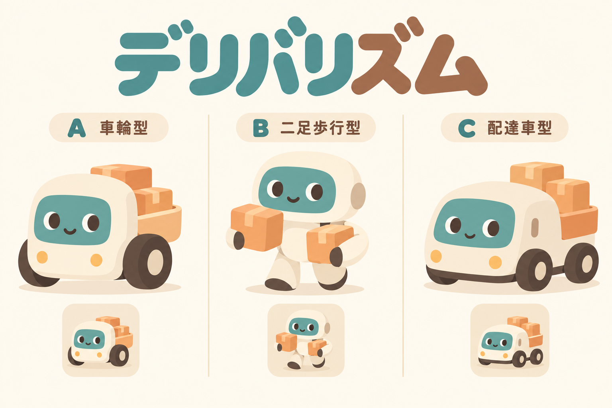

# デリバリズム 実装チャットへの引継ぎ

2026-09-26更新。要件v0.36／基本設計v0.3。**本体・アセットはローカル実装・自動検証済み、未公開。** [実装記録](implementation-log.md)を先に読み、実機受入の残件と検証コマンドを確認する。ミニメロディの要件定義は別作業として進め、新作同士の仕様を混ぜない。

## 1. 最初に読むもの

試遊反映済み：歩数の盤面別上限、矢印と終了アイコンの統一、凡例の可読性、移動速度、盤面を残して「つぎ」を待つ完了表示、スマホの高さ対応。具体値と再検証は[実装記録](implementation-log.md)の試遊フィードバック節を参照。

フッター・文字・ボタン・クリア表示・称号・自作面の見た目は、[UI整合確認](ui-consistency-review.md)に参照ソースと比較結果を記録。サイズだけの確認ではなく、計算済みCSSと実クリックの検証を維持する。

作業ルート：`C:/Users/user/Documents/project/koekit`。

1. ルート `AGENTS.md` → [共通実装ガイド](../implementation-guide.md)・[既存作品の引継ぎ](../handoff.md)。既存作品の旧記述を新作の確定要件より優先しない。
2. [デリバリズム要件書](../requirements-robot.md) v0.36。
3. [基本設計](design.md) v0.3。実装タスク・受入は9節、確定判断D-Q01〜03は10節。
4. [人向けサマリ](summary.md)、[ブランド方針](../brand.md)、[アセット引継ぎ](references/README.md)。

主要ルールの追加確認は不要。画面配置・語彙の細部・音量・生成余裕などは設計の想定を初期値として実装・試遊で具体化する。性能や実機精度を確認済みと称さない。

## 2. 変更してはいけない合意の要点

- 正式名はデリバリズム。旧仮称おつかいロボット。別名候補ミチノリズム／ダンドリズムは要件書に保存。
- 上下左右のみ、1マス1歩。ロボット1体・共通届け先1つ・所持最大2個・配置荷物最大4個。満杯なら追加荷物を残して通過。手ぶらの届け先通過は継続。
- やさしいは実配達で停止して次の指示を入力。残り指示は破棄。むずかしいは全配達を一括指示。全配達完了なら余剰指示を捨て即成功。
- 1発話1指示、発話確定後に表へ入る。途中挿入なし。「2ばん」→「した1」で置換後は末尾追加へ復帰。「もどす」は最後の1行、「やりなおし」は編集中の全列。数字単独は指示・行選択にならない。
- 表の行名は「1ばん」。確認前に経路や予想到着位置を盤面へ出さない。図示後オッケーで実行。
- 入力中は `上限−実行済み−入力列合計` をカウントダウン。負数は赤系＋「2歩オーバー」等で伝える。**アラートも警告音も出さず、超過でも実行可能。** 実行中は入力列を二重控除せず、実際の上限到達で未配達なら停止する。
- 失敗はスタート／おわりを選ぶ。スタートは編集に戻す語で自動実行しない。やさしいは直前配達checkpointと失敗区間の列へ復元、むずかしいは面の初期状態・列なし。失敗区間の歩数は返す。同じ問題で再挑戦。
- 4レベル×各3面、サイズ3/5/7/9、荷物1/2/3/4。全レベル初めから選択可能。新規プレイで生成、再挑戦で再生成しない。
- 初回練習は3×3・した1→みぎ2→した1、4歩。追加練習は荷物3個の2回配達。基本の受講記録は難易度共通、追加は難易度別。初回必須、以降スキップ可、任意再受講可。練習に称号なし。
- ヒントは次の荷物／届け先を強調→最初の1歩。全経路を出さず、入力列を書き換えない。任意・無制限・減点なし。
- 途中状態は本編／自作・難易度共通で最新1件を常時保存。中断は最後の確定stepで停止復帰し、操作で残りを再開。さいしょからは置換確認。おわりは途中状態を削除してタイトルへ。作成面・称号は消さない。
- 自作面は下書き・複製・削除可、最大10面。任意順の連続プレイ、称号なし。最低歩数は所持制約と全配達を含め計算し、上限を＋／−で最低以上に設定。解なし／未完成でも下書き保存は可能だがプレイとは区別。
- 本編称号は銅「おつかいルーキー」、銀「おつかいじょうず」、金「おつかいめいじん」、プラチナ「おつかいマスター」。難易度別記録、3面達成でトースト、タイトルに選択難易度の最高称号。直接Lv4クリアで下位記録を埋めない。
- B案二足歩行のキャラクターを採用。0個は両手空、1個は片手、2個は両手に1個ずつ。回収・配達と同期。上部所持2枠も併用。
- SE・ジングル必須。移動音は「ピコピコピコ」の軽い電子音。移動・効果音中は認識停止、終了で予約音も停止。BGMの追加は合意に含まない。

## 3. アセット共有と制作状態



この画像は**キャラクター比較の原画像**。中央Bのみ採用で、A/Cは不採用。完成素材は `assets/delivery/robot-{empty,one,two}.webp` と `assets/brand/deliverhythm.svg`。PNG原本・プロンプト・検証は[制作記録](assets.md)を参照。白背景の比較シートをそのままゲーム素材として使わない。

原画像を会話固有フォルダから本書と同じリポジトリへ複製済み。別チャットではこの相対参照で閲覧できる。[素材一覧・制作指示](references/README.md)に、共通ズムの実ファイル、既存ロゴ、制作予定物と検証を記載。

D-T10の素材制作は完了。実機での視認性・試聴はD-T08の残件。

## 4. 実施した実装順（結果は実装記録）

1. D-T01：配達ルールと復元、D-T02：最短探索／生成。手計算の固定問題で検証。
2. D-T10：ロボット3状態とロゴ、SE／ジングル。表示と音の制作を進める。
3. D-T03〜04：指示表・音声・歩数表示・保存再開。
4. D-T05〜06：本編進行、称号、2つの練習とヒント。
5. D-T07：エディタ、最短歩数調整、連続プレイ。
6. D-T08：トップ導線・共通UI・PWA・既存作品回帰・実機受入・公開準備。

D-T09の外部共有は後続で、初版には実装しない。実装対象は新規 `delivery/` を基本とし、共通部品の修正は後方互換を維持する。詳細な完了条件と検証項目は基本設計9節を参照。

## 5. 調整が必要な点と誤実装防止

- 歩数上限の余裕・生成試行回数・タイムアウト・音色／音量／長さは仮値。試遊の結果を記録する。
- 自作面は座標操作、本編は方向＋歩数。語彙と区間を分ける。一息複数入力の誤採用と、同じ指示を続けて言ったときの過剰な重複除去を避ける。
- 基本練習は固定済み。追加練習の盤面は作成して解・所持2個・2回配達を検証する。
- SE・ジングルは端末内合成で実装済み。区間停止と予約音取消は検証済みだが、実機試聴・音声認識への回り込みは未確認。
- コロガリズム移植元：`C:/Users/user/Documents/AI連携ゲーム/corogalism`。読取のみ。境界壁と障害物セルは表現が違うのでDFS/BFSの無変更コピーでは成立しない。
- 既存 `Progress` は称号やゲーム名が固定。新作4段階を渡すだけでは不十分。共通のメダル描画を再利用し、既存ゲームの記録を壊さない。
- 二重進行、別タブの上書き、正式終了後の古い音・探索・保存による復活をテストする。
- PC／スマホ、マイク拒否、タッチのみ、初回モデル取得失敗／取得後オフラインを分けて確認。実機で未確認の事項は引継ぎに残す。

## 6. Git・作業環境の注意

この引継ぎ作成時点で要件・設計・比較画像は未コミット。**同じフォルダを別チャットで開けば参照できるが、新規worktree／別端末には未コミットの新規ファイルは自動で渡らない。** 先に必要ファイルを転送またはコミットしてから別checkoutで開始すること。

既存作業に `src/speech/vosk.js` と `docs/ideas.md` の変更、LP資料と添付画像がある。自分の成果と決めつけて巻き戻す／一括コミットしない。開始時にgit statusとdiffを確認し、同じアプリを複数チャットで同時編集しない。こちらの次の要件定義はミニメロディ用の別文書へ分ける。

新規delivery・専用素材・トップ導線・SW事前保存・版検証を追加済み。既存4作品・共通srcの74ファイルは開始前後ハッシュ一致。デプロイ済みではない。実装完了時は既存版管理とキャッシュ手順に従い、公開状況と実機検証状況を別々に報告する。

## 7. 次のチャットへ貼る文

```text
デリバリズムはローカル実装・アセット制作・自動検証済みです。残る実機受入を進めてください。
作業フォルダは C:\Users\user\Documents\project\koekit です。
AGENTS.md と docs/delivery/handoff.md、docs/delivery/implementation-log.md を読み、要件・基本設計の確定事項に従って進めてください。
参考画像は docs/delivery/references/robot-concepts-abc.png、採用は中央のB案です。
完成素材と制作記録は assets/delivery/ と docs/delivery/assets.md にあります。既存4作品は参照だけにしてください。
既存の作業中変更を保護し、実装・検証結果と残る実機確認をドキュメントへ反映してください。
```
