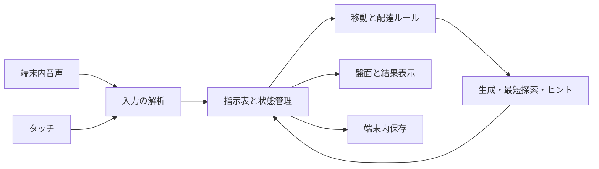

# デリバリズム 基本設計サマリ

2026-09-26／基本設計v0.3／ローカル実装・自動検証済み、未公開。[実装記録](implementation-log.md)に結果と実機受入の残件を記載。詳細の正典は[基本設計書](design.md)、遊びの合意事項は[要件書](../requirements-robot.md)。

## できあがりの構成

- 本編：4レベル×3面。やさしい／むずかしいを切り替え、音声かタッチで1指示ずつ表に並べ、オッケーで実行。
- 固定練習：開始時と複数回配達の導入時。初回は必須、以降スキップ可能。
- 自作：最大10面。下書き保存・複製・削除・順序指定の連続プレイ。最低歩数を示して上限を調整。
- 記録：途中自動保存と本編称号を分離。おわりで途中保存だけ消す。自作面には称号なし。

## 技術判断

既存の素のHTML/CSS/JSと共通音声・マイク・画面案内を継承。配達ルールは画面から独立した純粋関数にし、生成・最低歩数・ヒントで同じルールを使用する。探索はWorkerで動かし、編集や終了で古い結果を無効にする。

イロドリズムは盤面操作の参考にするが、色パレットに依存した描画をそのまま転用しない。コロガリズムのDFS/BFSをセル障害物方式へ適応し、最大2個の所持・全荷物の配達を含む状態で最短歩数を計算する。移植元は変更しない。

## 実装の順番

1. 配達ルール・最短探索・自動生成。
2. 指示表と音声、保存・再開。
3. 本編・称号・練習・ヒント。
4. エディタ・連続プレイ。
5. 共通UI統合・実機確認・公開準備。

全機能IDに対応するタスク、完了条件、異常系の検証は基本設計9節に記載。実装・デプロイ・実機検証はまだ行っていない。

## 確定した3点（2026-09-26）

| 項目 | 確定内容 |
|---|---|
| 歩数超過 | 入力中の残り歩数をカウントダウン。負数を赤系＋文字で示し、アラートなしで実行可能。実歩数上限は厳守 |
| 保存と再開 | 最新プレイ1件。中断は最後の確定した1歩で停止復帰。さいしょからは置換確認、おわりはタイトルへ |
| 受講記録 | 基本操作は難易度共通。配達の区切りが異なる追加練習は難易度別に1回。練習に称号なし |

3点とも発案者合意済み。基本設計10節に判断記録を残し、実装タスクへ反映した。

## 更新範囲

新設はこのサマリと基本設計書。要件書に合意済み機能のIDを補い、共通の画面・データ・タスク・実装ガイド・READMEに参照を追加。既存作品のルール、コード、公開版、AGENTS/CLAUDE入口は変更していない。

## キャラクターと音

B案の二足歩行ロボットを採用。所持0個は両手空、1個は片手、2個は両手に荷物を持ち、上部の所持2枠も同期。SE・ジングルは必須で、移動音は「ピコピコピコ」の軽い電子音。音色・長さは試聴で調整する。

## 実装チャットへの引継ぎ

[実装引継ぎ](handoff.md)を入口とし、[アセット資料](references/README.md)と比較画像も同じリポジトリ内で共有する。採用はB案。[完成素材と制作記録](assets.md)も保存済み。
