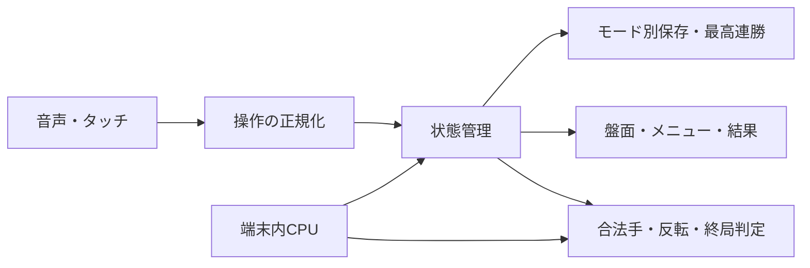
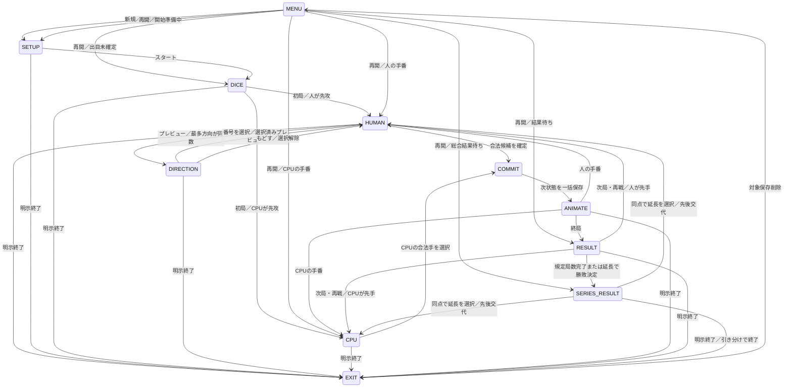

# ジントリズム 基本設計書

版：0.3／作成・更新：2026-09-20／状態：実装・自動検証・HTTPS公開済み。Android/iOS実機発話・PWA受入は未実施。

## 1. 位置づけと読み方

会話で合意した要件を、画面・処理・データ・検証へ落とし込む。要件の基準線は [仕様相談](jintorhythm-discussion.md) の合意事項と末尾の要件ID一覧。共通制約は [実装ガイド](implementation-guide.md)、既存作品の現状は [引き継ぎ](handoff.md) を参照する。

- **確定**：発案者と合意した要件。設計都合で変更しない。
- **設計判断**：要件を実現する技術的な構造。新たなゲームルールへの同意を意味しない。
- **【想定】**：具体化のための案。要件として確定していない。
- **【要確認】**：該当機能の確定前に発案者判断が必要。第10節に集約する。

基本対戦・特殊色・対戦構成・色選択・保存の主要仕様は合意済み。過去の合意は [初期相談](next-games-discussion.md) も照合した。第10節は解決済み事項と実装時の調整を区別する。過去の助手提案や改訂履歴より、訂正を反映した現在の本文を優先する。

## 2. 全体構成・既存基盤との接続

素のHTML/CSS/JavaScript・ES Modules・ビルドなしを継続。サーバー、アカウント、通信対戦、追加ライブラリは導入しない。盤面とCPU判断は端末内で処理する。



### 現行コードの確認結果

| 対象 | 確認した内容 | ジントリズムでの扱い |
|---|---|---|
| `irodori/board.js` | 可変サイズ、行列ラベル、選択枠。描画はイロドリズムの色パレットに依存 | 座標・グリッド構造を活用。所有者表示は専用ビューに分離 |
| `irodori/vocabulary.js` | A/E/Hの検証済み読み、行列トークン。制作専用語も含む | 座標語彙を共通部品へ抽出する場合は既存入出力を維持。全文法を流用しない |
| `irodori/app.js` | 数字だけの訂正を含む操作制御はアプリ側。描画・履歴・制作手順を管理 | 制作コントローラや履歴機能を対戦へ丸ごと移植しない |
| `src/speech/index.js`、`public-method.js` | 公開版の端末内認識方式を制限 | 既存ファクトリ経由。外部音声認識へフォールバックしない |
| `src/game/progress.js` | 既存作品のクリアID・称号保存 | 連勝保存とは別構造。既存キーを書き換えない |
| `src/ui/micstate.js`、`screenawake.js`、`src/audio/sfx.js` | マイク表示・消灯防止・効果音 | 共通利用。認識受付と効果音区間を分離 |
| `kioku/index.html`、`styles.css` | 切替と大きい開始ボタンで構成されたメニュー | 密度の参考。ジントリズムが同じ高さに収まるかは別途実画面検証 |
| `sw.js` | シェル事前キャッシュ、モデルを除外した更新 | 新ページと依存モジュールを追加。モデルを毎回再取得しない |

### 実装ファイルと責務（設計判断）

実装パスは `jintori/`。以下を新設した。ローカル検証結果と実機確認の残件は [実装記録](jintori-implementation-log.md) を参照。

| ファイル | 責務 |
|---|---|
| `jintori/index.html`、`styles.css`、`view.js` | メニュー・盤面・ダイアログ・結果。CSSは作品内へ限定 |
| `jintori/app.js` | 入力・状態遷移・CPU・保存・表示の接続 |
| `jintori/rules.js` | 初期配置、合法手、通常／特殊反転、パス、終局。DOMと保存に依存しない純粋関数 |
| `jintori/config.js` | 難易度、盤面進行、特殊色解放、支給数、CPU予算、演出時間 |
| `jintori/cpu.js`、`cpu-worker.js` | 手の評価。重い探索はWorkerで実行し中止可能にする |
| `jintori/commands.js` | 専用文法と座標・色種・確定・終了の操作変換 |
| `jintori/voice.js` | 区間ごとの認識開始・停止、遅延結果の無効化、開始失敗時のタッチ継続 |
| `jintori/run.js` | 規定局数・延長・連勝・先後・支給・色選択の状態遷移 |
| `jintori/storage.js` | 保存検証、読み込み、確定状態保存、正式終了、最高記録 |

## 3. 対戦ルールと処理境界

### 3.1 通常対戦

確定：セルを塗りつぶし所有者を文字でも表示。基本色は通常の挟み方で**全方向**を反転する。盤面は4×4・6×6・8×8。音声／タッチで候補を表示し、オッケーで確定する。

以下の通常ルールは確定。2026-09-20発案者合意により、初期配置・先後に加え、自動パス・終局・勝敗判定も確定した（R-02解決済み）。

- 【確定：2026-09-20発案者合意】4×4・6×6・8×8とも、中央2×2に両陣営のセルを2枚ずつ対角配置する。
- 空きセルだけに置ける。
- 隣接する相手セルが連続し、その先が自分セルなら、その列を反転。8方向を独立に判定。
- 通常反転が1枚以上ある位置を合法手とする。自分セル・空白・盤外で走査を終了。
- 手がない側は自動パス。両側に合法手がない場合は空白が残っていても終局。満杯も終局。
- 所有セル数の多い側が勝ち。同数は引き分け。先後の決め方は下記の音声サイコロで確定。次局・再戦では前局の先攻と後攻を交代する。

### 先攻決定（2026-09-20発案者指定）

- ピタリズムの音声サイコロを活用し、出目をランダムにする。
- 奇数ならユーザー（プレイヤー1）が先攻、偶数ならCPU（ふたり対戦ではプレイヤー2）が先攻。
- 初局のみ音声サイコロで決める。次局・再戦は勝敗によらず先後を交代し、サイコロは振り直さない（発案者指定）。
- 共通制約どおりサイコロもタッチで操作できるようにする。既存ピタリズム自体の挙動変更を意味しない。
- 途中再開では保存済みの手番を維持し、先後の交代やサイコロの振り直しは行わない。各局の先攻陣営を保存し、次局の先攻は前局の先攻と反対の陣営にする。

### 3.2 特殊色

| 種類 | 確定した効果 | 選択・判定の条件 |
|---|---|---|
| 基本 | 通常反転を弱くしない。使用上限なし | 開始前に12色から選択。未選択時は白／黒 |
| 強化 | 通常の全方向反転に加え、置いたセルの上下左右に隣接する相手セルを挟めていなくても反転。斜めには追加効果なし。効果は置いた瞬間のみ（2026-09-20確定） | 通常の合法手に限定（合意済み） |
| 最強 | 自分セルを飛び越え、挟まれた相手セルを取る。最多の**1方向のみ**。他方向は通常反転 | 空白で終了。方向ごとの「通常に取れる数＋飛び越えた先で取れる数」が最多の方向に適用。最多が同数ならユーザーが方向を選択（合意済み） |

共通：確定使用時に残数を1減らす。追加効果0でも消費。無効手・候補選択・言い直し・取消では消費しない。置いた後に強さ・耐性を残さない。反転完了後は置いたセルも取ったセルも、その陣営が選んだ基本色に揃える（合意済み）。

**4×4は基本色のみ。6×6・8×8では強化・最強の両方を使用可能。** 難易度や過去のクリア記録による追加の解放条件は設けない。4×4で使えない特殊色をCPUが使うことも禁止する。

| 持ち方 | 両陣営それぞれの初期値 | 補充の扱い |
|---|---|---|
| 毎局補充 | 強化1回・最強1回 | 使用可能なサイズでは各局開始時に規定数へ戻す。残数へ加算して蓄積しない |
| 持ち越し | 対戦全体で強化3回・最強1回 | 使用分は戻さず、次局・再戦・延長へ残数を引き継ぐ |

両対戦形式で持ち方を選択できる。回数は合意済みの初期値であり、設定データで後から調整する。設計判断：4×4開始時も持ち越し在庫は保持するが使用はできず、6×6への進行時に初めて使用可能になる。サイズ進行を追加補充の契機にしない。

最強色の固定受入例（右端◎が新しい自分セル）：

```text
〇●〇〇●●●◎ → 〇〇〇〇〇〇〇◎
〇●●●●●●◎ → 〇〇〇〇〇〇〇◎（追加恩恵なし）
●●〇〇●●●◎ → ●●〇〇〇〇〇◎（左端は挟まれていない）
```

反転計算は配置前盤面を基準に、通常の集合と特殊の集合を求め、重複を除いて一括適用する。方向を順次反転して後の方向の判定に影響させない。プレビューと確定には同じ計算関数を使う。

`analyzeMove(state, cell, itemType)` は合法性・通常反転集合・追加反転集合・最強方向候補を返す。`applyMove` はその手番と残数を再検証して次状態を返す。最強色は、方向ごとの「通常に取れる数＋飛び越えた先で取れる数」を比較し、最多の1方向に飛び越えを適用する。同じセルは重複して数えず、ほかの方向は通常どおり反転する。最多が同数の方向は候補として表示し、ユーザーが適用方向を選択できる（合意済み）。人の手番では方向の選択と反転範囲の図示後にオッケーで確定する。特殊色も通常の挟み込みが成立する合法手に限定する。

### 3.3 対戦構成

| 構成 | 対戦相手 | 局数・盤面 | 総合結果 |
|---|---|---|---|
| 規定局数の対戦 | CPU／ふたり | 1・3・5局から選択。4×4・6×6・8×8から選んだサイズを最後まで固定 | 規定局数をすべて行い、勝利数の多い側が勝ち |
| 連勝チャレンジ | CPUのみ | 4×4で開始。勝利で6×6、8×8へ進行し、以後8×8 | 現在連勝・最高連勝に挑戦 |

規定局数の対戦では引き分けも1局として数える。全局終了時に勝利数が同数なら「引き分けで終了／延長して決着」を選択できる。延長はどちらかが1勝するまで続ける。延長の引き分けでも先後を交代し、盤面サイズ・両者の色・補充／持ち越し設定を維持する。延長でも毎局補充は補充し、持ち越しは残数を維持する。

規定局数の総合勝敗と、連勝チャレンジの連勝記録は別に扱う。ふたり対戦の連勝チャレンジは作らない。

### 3.4 連勝チャレンジの対局間進行

| 結果 | 現在連勝 | 次のサイズ（連戦） | 毎局補充 | 持ち越し |
|---|---|---|---|---|
| 勝ち | ＋1、最高値を更新 | 4→6→8→8 | 次局開始時に規定数 | 両陣営の残数を維持 |
| 負け | 0、最高値は維持 | 同サイズで再戦 | 同上 | 使用分を戻さない |
| 引き分け | 維持、加算なし | 同サイズで再戦 | 同上 | 使用分を戻さない |

勝ち・負け・引き分けのいずれも終了できる。2連勝→引き分け→勝利は3連勝。敗北による連勝リセットとアイテム補充は独立する。結果を再表示しても二重加算しない。

この表はCPU専用の連勝チャレンジに適用する。規定局数の対戦では勝敗によって盤面サイズを変更しない。

## 4. メニュー・画面・入力

### 4.1 画面構成

| ID | 表示・操作 | 次／戻り先 |
|---|---|---|
| JT-S01 メニュー | ロゴ、対戦相手・構成・持ち方、CPU難易度、規定局数とサイズ、チャレンジ最高連勝。保存があれば「続きから／新規」 | 新規→S06。再開→保存状態。コエキットトップへ戻れる |
| JT-S02 対戦 | 手番、双方のセル数・残数、局数または連勝、座標付き盤面、選択中の「きょうか／さいきょう」、影響範囲と番号候補、大きなオッケー、もどす、終了、説明 | 確定→演出→相手手番。終局→S03 |
| JT-S03 結果 | 各局の勝敗・セル数・勝利数。規定局数終了時は総合結果と同点時の終了／延長。チャレンジは現在／最高連勝と次局／再戦 | 次局・延長→先後交代してS02。終了→S01 |
| JT-S04 説明 | 短い図解と発話例。盤面の常設説明を増やさない | 閉じる／オッケー→元の画面 |
| JT-S05 終了確認 | 【画面設計案】「おわる／つづける」。新規の選択はS01で扱い、追加の置換確認を必須仕様にしない | 明示終了→対象途中保存のみ削除。キャンセル→元画面 |
| JT-S06 開始準備・先攻決定 | 12色の選択、選択担当、オッケー、スタート。開始後は音声サイコロで初局先攻決定 | 色選択→スタート→サイコロ→S02。各操作はタッチでも可能 |

メニューは「コンピュータ／ふたり」、CPUの場合に「規定局数／連勝チャレンジ」を選ぶ。ふたりは規定局数の対戦。規定局数では1／3／5局と4×4／6×6／8×8、両構成で毎局補充／持ち越しを選択する。4×4固定では特殊色が使えないことを示す。組合せをすべて大きな入口ボタンとして並べない。CPU難易度は「やさしい／ふつう／むずかしい」の3段階で、盤面進行や持ち方から独立。設定画面は必須範囲に含めず、調整値はデータで管理する。

フォント・基本色・アイコンの正典は [共通画面設計](screens.md) と [ブランド](brand.md)。自前配信のM PLUS Rounded 1cと既存SVGの作法を継承。ジントリ＋共通ズムの文字ロゴを作成し、専用アイコンは必須にしない。所有者文字と印で色以外にも区別する。

最強色で最多方向が同数の場合は方向選択を表示し、音声・タッチの両方で選択可能にする。方向未選択では確定不可。確定ボタンは候補なし・不正な候補で非活性。残数0の特殊色も非活性。常設操作は大きくし、盤面ラベルや説明が枠に接触しない。ロゴは縦横比を維持。320×568の8×8ではセル全てを48pxにはできないため、盤面を無理に縮めず操作領域との釣り合いを実画面で検証する。盤面以外の主要ボタンは48px以上を目標とする。

自動パスなどの進行情報はトーストで通知する（2026-09-20発案者指定）。例：「プレイヤー1は置ける場所がないためパスします」。誰に何が起きたかを短く表示し、確認操作は求めない。表示時間は調整値として管理する。

### 4.2 開始前の色選択

2026-09-20追加指定：規定局数の固定盤面が4×4のときは「毎局補充」「持ち越し」を非活性にする。6×6・8×8を選ぶと再び選択できる。4×4へ切り替えただけでは選択値を変更しない。連勝チャレンジは6×6以降へ進むため持ち方を選択できる。

- イロドリズムと同じ12色（赤・水色・黄色・紫・緑・ピンク・青・オレンジ・黄緑・茶色・白・黒）から選ぶ。既存パレットと検証済みの色名語彙を活用する。
- 「スタート」発話前に「あお」「あか」などで選択でき、色ボタンでも同じ操作ができる。選択中の色を画面に表示する。
- ふたりはプレイヤー1→プレイヤー2の順。プレイヤー1は色を選んで「オッケー」または確定ボタンで確定すると、プレイヤー2の選択へ進む。同じ色は選べない。
- CPUの色はユーザーと重ならない色を自動選択する。双方未選択で「スタート」の場合は白／黒。片方のみ選択済みならその色を維持し、未選択側は白／黒のうち重ならない色にする。
- 設計判断：双方未選択時はプレイヤー1を白、相手を黒。片方が白・黒以外なら未選択側の既定色を維持する。先攻は色とは独立してサイコロで決める。
- 開始は発話「スタート」または開始ボタン。再開時は保存された両者の色を復元し、色選択をやり直さない。
- セルは塗りつぶしと所有者文字で識別する。合意済みの所有者表示を維持し、文字のコントラストは選択色に合わせて調整する。

### 4.3 対戦中の操作手順

| 操作 | 手順 |
|---|---|
| 基本色 | 座標指定→影響範囲をプレビュー→オッケー |
| 強化・最強 | 「きょうか／さいきょう」の発話またはボタン→種類を分かりやすく表示→座標指定→影響範囲をプレビュー→オッケー |
| 最多方向が同数 | プレビューに候補①②…を表示→番号を発話またはタッチで選択→オッケー |
| 確定前の取消 | 「もどす」の発話または取消ボタン→特殊色選択・座標・方向候補のプレビューを取り消す |

特殊色の選択はその1手に限る。確定後は選択を解除し、次の手へモードを保持しない。取消では残数も手番も変えない。確定後の手を取り消す機能ではない。番号を選んだだけでは着手せず、選択した影響範囲の図示を経て別のオッケーで確定する。

設計判断：座標や特殊色の言い直しで候補を再計算した場合、以前の方向番号は無効にして新しい候補から選び直す。番号と方向の対応はそのプレビュー中は固定する。CPUは同じ候補集合から難易度方針に沿って選択し、人へ選択を求めない。

### 4.4 音声・タッチの処理

- 座標はA1／1Aの両順序を扱い、行1始まり・内部0始まりへ変換する。8×8の最大はH8。盤外指定は不正解音と短い表示で知らせ、移動・消費しない。
- **数字だけの入力から前の列を補完しない。** 列・行が揃わない入力では新しい座標候補を作らない。方向選択区間に限り数字を①②…の候補番号として扱う。座標の行訂正へ流用しない。認識なしは不正解として集計しない。
- 完全な座標の言い直しで確定前候補を置き換える。位置と色種のプレビュー後、別のオッケー操作で確定する。座標＋確定語が同一結果に含まれる場合も図示を飛ばして確定しない。
- 【設計判断】不合法な位置を指定したら古い候補は確定不可にし、古い位置へ誤って置かない。確定後の待ったは合意範囲に含めない。
- A＝えい／ええ／えー、E＝いー／いい、H＝えっちの検証済み候補を維持。Hへえいち・えーちを追加しない。案内では「えい」を優先する。
- 相対移動、範囲指定、線、保存など制作専用の操作は自動移植しない。相対移動の採否は必要なら別要求として扱う。
- 色選択区間では12色の読み・オッケー・スタートを使用。人の手番では座標・きょうか・さいきょう・もどす・オッケー・終了を扱い、方向選択区間のみ候補番号を追加する。使用不可の特殊色は受付対象から外す。サイコロ・説明・結果・延長選択・終了確認も区間別の必要語彙に限定する。
- CPU思考・反転演出・効果音中は認識停止。終了はタッチでも常に可能。番号とオッケーが同一認識結果に含まれても、選択の図示を飛ばして着手しない。
- ふたり対戦も現在手番の入力として扱う。声による本人識別は行わない。

## 5. 状態遷移と非同期処理



パスは手番解決処理内で判定し、トースト表示後に次の受付区間へ進む。説明と確認ダイアログは元状態を保持する一時状態とし、背面入力を遮断。キャンセル時は元の状態から再開する。

図のHUMANは未選択／種類選択済み／有効プレビューを含み、オッケーでCOMMITへ進めるのは有効プレビューがある場合だけ。ふたりでは両陣営ともHUMANへ進む。初局サイコロの出目・先攻を保存し、確定後の復帰で振り直さない。規定局数の総合結果待ちは保存し、再開後も終了／延長を選択可能にする。明示終了が確定するまでは途中状態を保持する。

確定は「入力を閉じる→合法性再確認→配置・全反転・消費・手番／パス／終局・記録を計算→一括保存→演出」の順。演出途中で中断しても復元は計算済みの次状態から行い、同じ手を再実行しない。

CPU要求に`runId / matchId / revision / generation`を付ける。終了・新規開始・手番変更後に返った古い結果は捨てる。連打や遅れた音声も同じ世代・状態検証を通す。バックグラウンドではCPUと認識を停止し、復帰時に現在状態から再開する。

## 6. CPUと調整値

2026-09-20効果音追加指定：`jintori/sound.js`で着手の木音、反転枚数に応じた短い連続音、強化の和音、最強の風音とベル、サイコロ、パス、勝利・敗北・引分、不正座標を鳴り分ける。Web Audioで端末内合成し、他作品の音は変更しない。最大6音の反転連続音に制限し、音の終了時間まで認識を止める。終了・非表示・ダイアログで予約音も取り消す。

双方とも同じルール関数・在庫・補充条件を使う。CPUだけアイテムを増やしたり、手の合法性を緩めたりしない。

| 強さの方向 | 判断設計 |
|---|---|
| やさしい（easy） | 合法位置の選択と基本／特殊色の選択を分離。残数のある色から選び、追加効果の有無を評価しない。恩恵0でも使用する。意図的に控える実装にしない |
| ふつう（normal） | 取れる枚数・角・特殊色の効果を考えて選ぶ |
| むずかしい（hard） | 相手の次の手と、特殊色を残す価値まで考えて選ぶ |

`config.js`にサイズ進行、難易度ID、特殊色の使用可能サイズ、毎局支給（強化1・最強1）、持ち越し初期支給（強化3・最強1）、CPU選択重み・探索上限・時間予算、演出・トースト時間を集約する。支給数は合意済み初期値を使用し、評価値等は実機で調整。開発時は乱数源を注入し、CPUとサイコロのテストを再現可能にする。

探索時間の上限に達したら、その時点の合法な最善候補を返す。強いCPUでもUIを止めず終了操作を受け付ける。難易度は3段階で確定（2026-09-20発案者合意）。評価重み・探索深さ・時間予算・使用頻度の具体値は実機評価で調整する。盤面進行・毎局補充／持ち越しとは独立させる。

## 7. データと自動保存

### 7.1 保存単位

確定：モード別・CPU難易度別に途中保存を分け、同じ枠には最新の1件だけを保持する。盤面サイズや規定局数ごとには分けない。保存があれば「続きから／新規」を選べ、新規ではその枠のみ置換して最高記録を維持する。

設計判断：既存案のモード定義`opponent × structure × supplyPolicy`に`difficultyId`を加えた固定IDで枠を構成する。`structure`は`series / streak`、ふたりの難易度は`none`。サイズ・局数・色は枠キーに含めず保存内容に持つ。ふたりの`streak`は不正な組合せとして拒否する。補充／持ち越しは両構成で扱い、旧案の「1局ではnone」正規化は廃止する。

キー案：`koekit.jintori.v1.<slotKey>`。既存作品のキーと分離。1枠1レコードに途中状態と最高記録を持ち、正式終了は`active = null`へ置換して最高記録だけを残す。これは途中保存の論理的な削除であり、次回「つづきから」を出さない。レコード全削除や`localStorage.clear()`は使わない。

最高記録と途中保存は論理上独立させ、1キーへの書き込みで終局状態と最高記録を同時に更新する。別キー間の書き込み途中で二重加算・最高記録消失が起きる構成を避ける。

| エンティティ | 主な属性 | 用途 |
|---|---|---|
| SlotRecord | `schemaVersion, revision, bestStreak, active, updatedAt` | モード枠。`active=null`でも最高記録を保持 |
| RunState | `runId, mode, rulesVersion, configSnapshot, phase, colorsBySide, initialDice, completedMatches, currentStreak, bestStreak, series, inventoryBySide, match` | 難易度はmode内。チャレンジにも消化局数を持ち、初局出目と各局先攻の交代を検証する |
| SeriesState | `plannedMatches, fixedSize, completedMatches, winsBySide, draws, extensionActive, outcome` | 規定局数と勝利数・引き分け数、延長状態を復帰。画面phaseはRunState側。チャレンジではnull |
| MatchState | `matchId, size, cells, firstSide, sideToMove, phase, outcome, resultApplied, moveNumber` | 次局の先攻は前局のfirstSideから交代し、終局時の手番やパスに左右されない。`cells`は`0=空、1=陣営1、2=陣営2`の長さsize²配列 |
| Inventory | 陣営別の`enhanced, strongest`非負整数 | 共有在庫にしない。基本色の残数は持たない |
| PendingSelection | `cell, item, analysis, directionId` | analysis内にnormal・extra・directions・needsDirection。表示用メモリ状態で、確定後・取消・再開では解除する |

`phase`の保存値は準備／初局サイコロ待ち／人待ち／CPU待ち／各局結果待ち／総合結果待ちなど安定した状態に限定し、演出タイマーや認識器は保存しない。設計判断：新規開始状態を保存し、色・条件を確定したスタート時とサイコロ出目確定時にも保存する。出目未確定ならサイコロ待ちへ戻り、確定済みなら再抽選しない。`resultApplied`と`matchId`により勝利数・引き分け数・連勝・残数の二重更新を防ぐ。規定局数の成績でチャレンジ最高連勝を更新しない。

### 7.2 保存・復帰・正式終了

| 契機 | 保存処理 | 次回 |
|---|---|---|
| 新規開始 | 選択枠のみ新しいrunを作る。最高記録は維持 | 開始状態から再開 |
| スタート・出目確定・手の確定・パス・終局・次局開始・延長選択 | 全ての関連状態を一括更新 | 最後に確定した状態から再開 |
| ページ非表示・予期せず閉じる | 削除しない。確定時保存が主で離脱イベントには依存しない | つづきから |
| 正式終了 | 対象枠の`active=null`を保存 | 当該枠に再開導線なし |
| 他モード開始 | 他枠を変更しない | 各モードで独立再開 |

終了時は最初に終了フラグと世代番号を更新し、入力停止、CPU中止、タイマー解除、音停止、消灯防止解除を行う。その後に途中状態を消す。保存関数も終了済み世代からの書き込みを拒否し、遅れて完了したCPUや保存予約が復活させないようにする。

新規開始は合意済みの「続きから／新規」選択で扱い、新規を明示選択した場合に同じ枠の途中状態を置換する。追加の置換確認を合意済み仕様として要求しない。正式終了はアプリ内の終了操作であり、ブラウザバック・タブ閉じ・OSによる終了を含めない。

保存が使えないときもタッチ対戦は継続可能にし、「この端末に保存できません」と表示する。削除の書き込みに失敗したときは終了成功を装わず、再試行導線を表示。他作品の保存を削除して回復させない。

読み込み時は版・配列長・値域・初局出目・先攻・手番・非負残数・モード整合を検証する。色は12色内かつ双方異なること、規定局数は1/3/5、固定サイズは4/6/8、勝利数・引き分け数・消化局数・延長状態が整合することも確認する。破損・非対応版は再開せず理由と新規開始導線を表示。正常な最高記録を取り出せる場合は維持する。更新時の互換変換がないルール版へ黙って移行しない。

同一枠の複数タブは同時進行させない設計とし、`storage`通知で他タブ更新を検知したら入力を止めて再読み込みする。単なるrevision比較を原子的なロックとみなさず、書き込み競合の排他方式を実装時に検証する。異なる枠は互いに上書きしない。

実装：Web Locksで枠を排他し、`begin()`が返すleaseを`save()`・`finish()`へ必須指定する。新規開始・終了で古いleaseを無効化し、旧対戦の遅延書込み・削除を拒否する。`finish()`は保存削除とロック解放を待つ。Web Locksまたは保存を利用できない環境では保存不可を表示し、メモリ上で遊べる。終局盤面・得点・消化局数・出目と先攻の整合性も検証する。

保存日時はUTCのISO 8601。表示時のみ端末のIANAタイムゾーンへ変換し、不明ならAsia/Tokyo。音声そのもの・利用者名は保存しない。端末保存であり、ブラウザデータ削除や別端末への移動には対応しない。

## 8. 異常系と回復

| コード | 処理と利用者への案内 | 回復 |
|---|---|---|
| `INVALID_COORDINATE` | 範囲外・不完全な座標では確定しない | 完全な座標を言い直す／タッチ |
| `ILLEGAL_MOVE` | 盤面・手番・残数を変更しない。確定を非活性 | 別の位置を選ぶ |
| `NO_ITEM` | 0回の色を確定しない | 基本色／残数のある色 |
| `ITEM_UNAVAILABLE` | 4×4では特殊色を選択・使用しない | 基本色で継続 |
| `INVALID_DIRECTION` | 範囲外・未選択・古い番号では確定しない | 表示中の①②…から選択 |
| `COLOR_CONFLICT` | 相手と同じ色を確定しない | 重ならない色を選択 |
| `STALE_ACTION` | 古いCPU・音声・連打を無視 | 現在の表示を維持 |
| `VOICE_UNAVAILABLE` | マイク不可表示。外部サービスへ送らない | タッチで全操作 |
| `SAVE_FAILED` | 保存成功と表示しない。終了削除失敗も区別 | 再試行。対戦状態はメモリに保持 |
| `SAVE_INVALID` | 壊れた途中状態で対戦を始めない | 対象枠だけ新規開始 |
| `SAVE_CONFLICT` | 別タブと競合した枠への操作停止 | 最新保存を読み直す |

## 9. 実装順・完了条件・要件対応

JT-T01〜05のローカル実装と自動検証を実施。JT-T06はトップ・SW・版表示・既存作品回帰まで実施し、HTTPS公開と配信確認まで実施済みで、Android/iOS実機受入が残る。検証範囲と再実行手順は [実装記録](jintori-implementation-log.md) を参照。回数やAIの強さの実機調整と、基本ロジックの正しさの検証を分ける。

| タスク | 対応要件 | 成果・完了条件 | 検証方法 |
|---|---|---|---|
| JT-T01 ルール基盤 | JT-R02, JT-R03, JT-R04 | サイズ別初期配置・合法手・通常／特殊反転・終局の純粋関数。確定済みのR-01/02に従いルール境界を固定 | Nodeで辺・角・8方向・空白・自分セル・パス・全埋まり・空白残り終局。第3節の3例、通常5＋追加1と通常2＋追加3では前者を選ぶ例、最多同数候補を固定期待値として使用 |
| JT-T02 入力と盤面 | JT-R01, JT-R02, JT-R07, JT-R11, JT-R13 | S02、1手限りの特殊色選択→種類表示→座標→プレビュー→番号選択→確定、取消、所有者表示 | 座標の数字単独は無効・方向番号は選択区間だけ有効。同数候補・番号言い直し・もどす・確定後解除・残数不変・連打・マイク拒否。共通抽出時はイロドリズム既存入力も回帰 |
| JT-T03 進行とCPU | JT-R04, JT-R05, JT-R06, JT-R08, JT-R12, JT-R14 | 規定局数／延長、CPU専用チャレンジ、サイコロ・先後交代、サイズ制限・両陣営の残数・難易度 | 1/3/5局と固定サイズ、全局消化、同点→終了／延長→引分→決着、毎局1/1・持越3/1、4×4特殊禁止、6×6両特殊解放、勝→引分→勝、敗北・8×8継続。出目奇偶と再戦・延長の先後交代、CPUの恩恵0消費も検証 |
| JT-T04 保存と終了 | JT-R09, JT-R10, JT-R12, JT-R13, JT-R14 | 自動保存・続きから／新規・同枠最新1件・難易度分離・正式終了・最高記録 | サイコロ前後、CPU／演出途中、各局／総合結果、延長選択後の復帰。色・勝利数・残数・先攻を復元。二重加算・再抽選なし、同枠でサイズ／局数変更時は置換、他枠不変、終了後遅延処理、破損・容量不足・競合、UTC/JST月境界 |
| JT-T05 メニューと案内 | JT-R01, JT-R06, JT-R09, JT-R10, JT-R12, JT-R13, JT-R14 | S01〜06、12色選択、トースト、結果・延長・再開表示。ふたりにチャレンジを出さない | Chrome/WebKit、320×568・390×844・768×1024・PC。色発話／タッチ、P1確定→P2、同色拒否、未選択スタートで白黒、片側選択時の補完、CPU重複回避、枠接触・重なり・キーボード・縮小動作設定。モックと実DOM検証は別に行う |
| JT-T06 統合・受入 | JT-R01, JT-R11 | トップ遷移、ロゴ、SWシェル、版表示、説明、公開確認 | 既存3作品回帰、取得済みモデルでオフライン、Android/iOS実発話、8×8CPU応答と終了。stamp→push後は公開ファイル確認 |

既存のフェーズ0認識合格は再利用の根拠であり、ジントリズムの専用文法・CPU動作・8×8操作の受入完了を意味しない。ブラウザの模擬音声と実機発話は別に記録する。

版管理はコエキットの`version.json`を正典として既存規約に従う設計。実装時に新タイトルの版表示も`check-version.cjs`の検証対象へ追加する。今回の文書作成では版更新・デプロイは行わない。

## 10. 決定状況と残る調整

| ID | 決定状況 | 判断者・時点 | 次の作業 |
|---|---|---|---|
| R-01 | 解決済み：通常分＋飛び越え先の枚数で最多1方向。同数なら①②…からユーザー選択。空白を越えず通常合法手に限定 | 発案者／2026-09-20確定 | JT-T01・02で実装・検証 |
| R-02 | 解決済み：中央初期配置、初局サイコロ・以後先後交代、自動パス、双方合法手なしで終局、所有セル数で勝敗・同数引き分け | 発案者／2026-09-20確定 | JT-T01で合意済みルールを実装・検証 |
| R-03 | 解決済み：CPU・ふたりは1/3/5局・固定サイズ・同点時任意延長。チャレンジはCPU専用。4×4特殊不可、6×6・8×8は両方使用可能 | 発案者／2026-09-20確定 | JT-T03・05で実装・検証 |
| R-04 | 合意済み：モード・CPU難易度別の最新1件、サイズ／局数別には増やさない。「続きから／新規」、正式終了は途中のみ削除 | 発案者／2026-09-20確定。枠IDと画面の詳細は設計判断 | 第7節の保存方式を実装・競合検証。追加置換確認を必須化しない |
| R-05 | 初期仕様確定：毎局1/1・持越3/1、12色選択、きょうか／さいきょうの1手限り選択。CPU強さ・使用頻度・演出時間は実機調整 | 発案者と実装担当／初期値合意済み、調整は公開前 | 調整値の分離、発話精度・色の見やすさ・CPU応答を確認 |

上記の合意済み項目は聞き直さない。残作業は画面配置・実装方式の具体化と、初期値を使ったCPU・音声・表示の実機調整。実装上の設計判断を新たな発案者合意と記載しない。初期値を変更する場合は変更内容と検証結果を記録する。

## 11. 文書の更新範囲

- 新設：本書（基本設計・画面・データ・処理・タスクを一体化）。同内容を複数の新規文書へ複製しない。
- 更新：仕様相談に要件IDと参照、共通の画面・データ・タスク・実装ガイドに本書への入口を追記。
- 維持：既存作品の要件・実装・AGENTS/CLAUDE入口・README・版番号。既存作品の仕様変更や公開済みという誤解を生まないため。外部APIを追加しないのでAPI文書は新設しない。
- 検証：文書リンク・要件対応・設計内の整合性を確認。ゲームコードや実機動作のテストは実装後のJT-T01〜06で行う。

改訂履歴：2026-09-20 難易度3段階と各判断方針を確定。盤面進行・アイテムの持ち方と独立させ、未確定事項から難易度の段数を除外。

改訂履歴：2026-09-20 発案者合意により強化色の効果を通常の全方向反転＋上下左右の隣接相手セル反転（挟み不要、斜めの追加効果なし）に確定。R-01の残件から強化の効果範囲を除外。

改訂履歴：2026-09-20 発案者の訂正を反映。空白を越えない・方向ごとの総反転数で比較・特殊色も通常合法手に限定の3点を合意済みへ修正。同数時の固定順自動決定案は未承認として残す。

改訂履歴：2026-09-20 発案者の訂正により、最強色の最多方向が同数の場合はユーザーが選択できることを合意済みとして反映。直前の未承認・未確定の記載を訂正し、固定順自動決定案を撤回。

改訂履歴：2026-09-20 発案者の表現に揃え、最強色は最多の1方向へ適用し、同数の場合はユーザーが方向を選択すると記録。助手が補った総反転数という比較指標の断定を本文から除去。過去の改訂履歴にある同指標の確定扱いも本訂正で取り消す。

改訂履歴：2026-09-20 発案者と比較する枚数を「通常に取れる数＋飛び越えた先で取れる数」と明確化。方向ごとに比較し、最多が同数ならユーザーが選択する。

改訂履歴：2026-09-20 発案者指定により、ピタリズムの音声サイコロを活用しランダムな出目の奇偶で先攻を決定する仕様を追加。奇数はユーザー／プレイヤー1、偶数は相手。

改訂履歴：2026-09-20 発案者指定により、初局は音声サイコロ、次局・再戦は先後交代制に確定。途中再開は交代せず保存済みの手番を維持する。

改訂履歴：2026-09-20 発案者合意により、全盤面サイズの初期配置を中央2×2に両陣営のセル2枚ずつの対角配置で確定。

改訂履歴：2026-09-20 発案者合意により、自動パス・双方合法手なしでの終局（空きセルがあっても終了）・所有セル数による勝敗と同数引き分けを確定。R-02を解決済みに更新。

改訂履歴：2026-09-20 発案者指定により、自動パスなどの進行情報をトースト表示する仕様を追加。

改訂履歴：2026-09-20 v0.2。仕様相談の決定事項を一括反映。規定局数・任意延長・CPU専用チャレンジ、サイズ別の特殊色制限、毎局1/1・持越3/1、12色選択と白黒補完、1手限りの特殊色・番号プレビュー・取消、モード／難易度別最新1件保存を画面・状態・保存・検証へ接続。旧提案や過去の未確定記述は現行本文で更新した。ゲーム実装は未着手。

改訂履歴：2026-09-20 v0.3。合意仕様に沿うローカル実装・検証を反映。実装ファイル、消化局数を含む保存状態、leaseによる排他と遅延書込み防止、実装記録への参照を追記。Android/iOS実機受入・公開は未完了として区別した。
