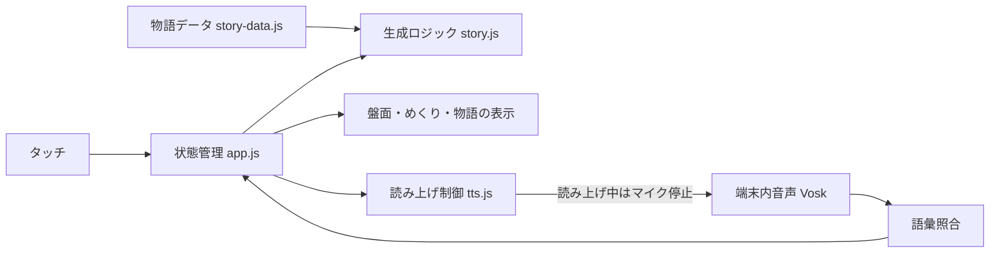
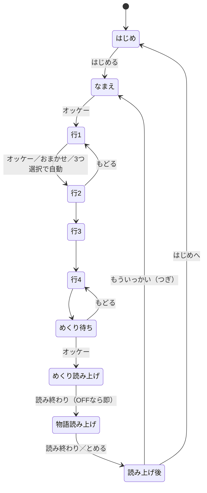

# モノガタリズム（仮称） 基本設計

版：0.1／2026-09-27。要件正典：[requirements-story.md](../requirements-story.md) v0.4。状態：MG-T01〜T04を `story/` に実装（2026-09-27）。声の入力は組み込み済みで、実機での聞き取り確認（T05）は後に実施。試作v1（場面カード連結）は `probe/story-v1/`。

## 1. 設計の範囲と前提

既存コエキットへの増分設計。素のHTML/CSS/ES Modules・ビルドなし・既存PWAを継承する。サーバー、認証、追加ライブラリ、保存・共有機能は導入しない。日時は扱わない。

印なし＝要件で合意済み、【設計】＝要件を満たすための技術判断（A・B区分で変更可）、【想定】＝初期値・未検証の仮置き、【要確認】＝判断待ち。

### 実装者への指示

- 共通制約は[実装ガイド](../implementation-guide.md)を正典とする。C-1〜C-4（音声を外部送信しない／タッチで全操作／2段階確定／コロガリズム不変更）は外さない。
- **読み上げ中は聞き取りを止める。** 読み上げ終了後に、その区間の語だけで聞き取りを始める（実装ガイド5節の5「常時音声認識にしない」と同じ考え方）。
- 番号は言ったその場で選択／解除し、盤面に表示する。カテゴリは「オッケー」で終える（上限3に達したら0.7秒後に自動で次へ）。カードをめくる最後の確定も「オッケー」。めくるまでは「もどる」で直せる（要件0章 C-3 の本作での当てはめ方）。
- 物語の生成は画面から独立した純粋関数にし、Nodeで検証する。乱数は引数で差しかえ可能にする。
- 文字表示は、この作品での例外として了承済み（要件3節）。ただし盤面は番号と印（トランプ風の ♠♥♦♣）だけにし、選ぶ段階で言葉を見せない。
- 既存作品のコード・保存キーは変更・流用しない。共通部品の拡張は後方互換にし、既存作品の回帰を確認する。
- A区分（画面・文言・材料・場面文）の指示は、文書更新を待たずに進めてよい。

## 2. 現行実装の確認と再利用

| 参照先 | 利用方針 |
|---|---|
| `src/speech/index.js`（`createSpeechInput`） | 方式Vosk。`start(words)` に区間ごとの語を渡す |
| `src/speech/vocabulary.js`（`normalize`・`match`） | 照合方式を踏襲。作品固有の語は作品側の語彙表に置く |
| `src/ui/mic-toggle.js`・`src/speech/microphone.js` | マイクON/OFF。OFF・拒否時は発話を促さない |
| `src/ui/voice-guide.js`・[発話案内の標準](../voice-guidance.md) | 今受け付ける語をボタン付近に常設 |
| `irodori/vocabulary.js` の数字の読み（1=いち…4=よん/し、5=ご） | 番号の受け付け読みの初期値として参照。移植元は変更しない |
| `irodori/app.js` の `speak()` | 読み上げON/OFFの前例。本作は1文ずつ・終了待ちのため別実装 |
| `assets/animals/` | 「だれと」の絵の候補（ライオン・パンダ等） |
| `sw.js`（network-first＋SHELL事前キャッシュ） | 公開時に本作のファイルをSHELLへ追加 |
| `story/`（試作v1） | 読み上げの検証パネル（声の一覧・端末内判定・開始までの時間の記録）を流用 |

## 3. 構成

| ファイル【設計】 | 責務 |
|---|---|
| `story/story-data.js` | 名前一覧、盤面の候補（言葉・絵）、場面カード、つなぎ文。A区分で自由に追加 |
| `story/story.js` | 盤面作成・おまかせ解決・物語生成・文分割（純粋関数） |
| `story/tts.js` | 読み上げキュー、1文ずつ再生、終了通知、ON/OFF、利用不可の判定 |
| `story/vocabulary.js` | 区間ごとの受け付け語と照合 |
| `story/app.js`・`index.html`・`styles.css` | 状態機械、画面、音声とタッチの統合 |

フォルダ（公開パス）は `story/`（発案者合意 2026-09-27）。

## 4. 画面と操作

デザイントークン（書体・色・ボタン）は共通の[画面設計](../screens.md)1節を継承する。

| ID | 画面 | 内容 |
|---|---|---|
| MG-S01 | はじめ | モード（こども／おとな）、読み上げON/OFF、読み上げの声（プルダウン。日本語の声だけ、端末内の声に印。選ぶと試し読み、OFFのときは選べない）、場面の順番（ふつう／めちゃくちゃ）、はじめる。フッタに版数と © 2026 SIKUMI LAB |
| MG-S02 | なまえ | 名前の一覧（こども・おとな別）。声またはタッチで候補→オッケー |
| MG-S03 | ばん | 4行×（こども4／おとな5）の裏向き盤面。カードはトランプ風（いつ♠・どこで♥・だれと♦・なにを♣、左上に番号、中央に番号の数だけ印。めくると絵と言葉）。今の行を強調し、行名（印＋文字）と受け付ける語を表示。選んだマスに印、上限到達の表示。ボタン：オッケー・おまかせ・もどる・オッケー（めくる） |
| MG-S04 | おはなし | めくった盤面（絵＋言葉、おまかせ印）と物語の本文。読んでいる文を強調。ボタン：よみあげ／とめる・もういっかい・はじめへ |

1マスの大きさ：画面幅約412で、こども4列＝約78、おとな5列＝約62【想定】（実機で視認性を確認）。絵は縦横比を維持し、試作は絵文字で代用。

### 音声受付表

| 状態 | 受け付ける語 | 結果 |
|---|---|---|
| はじめ | こども・おとな／ふつう・めちゃくちゃ | モード／場面の順番を切り替える（2026-09-27 追加） |
| はじめ | オッケー | なまえの画面へ |
| なまえ | もどる | はじめの画面へ |
| なまえ | 一覧の名前 | 候補を光らせる |
| なまえ（候補あり） | オッケー | 名前を確定して盤面へ |
| なまえ | おまかせ | 一覧からランダムに決めて盤面へ【設計】 |
| 行の選択 | いち・に・さん・よん（し）・ご（おとなのみ） | その場で選択（選択済みなら解除）。3つ目で0.7秒後に自動で次の行へ（2026-09-27 変更） |
| 行の選択 | オッケー | この行を終えて次の行へ（未選択ならおまかせ） |
| 行の選択 | おまかせ | 選択を消してランダム1枚にし、次の行へ |
| 行の選択 | もどる | 前の行へ（選択は保持） |
| 全行おわり | オッケー／もどる | カードをめくる／最後の行へ（2026-09-27 スタートから変更） |
| 読み上げ後 | つぎ【想定】 | 新しい盤面へ（もういっかい） |
| 読み上げ後 | おわり | はじめの画面へ（2026-09-27 追加） |
| 行の選択（最初の行） | もどる | なまえの画面へ（2026-09-27 追加） |

- 語はすべてVoskの辞書にあることを確認済み（10節）。「もういっかい」は辞書に1語として無いため、初期値は「つぎ」とする【想定】。
- 盤面の行の始まりでは、読み上げON時に行名を「いつ？」と読み、読み終わってから聞き取りを始める。読み上げが5秒以内に終わらない・開始しない場合は、聞き取りを始める【想定】。
- 読み上げ中（めくり内容・物語）は聞き取りを止める。停止はタッチの「とめる」で行う。

## 5. 状態遷移

- 各状態で「はじめへ」（タッチ）を出す。途中の状態は保存しない（中断したら最初から）。

## 6. 物語の生成規則

- **流れの型**（2026-09-27 案B）：`data/*.json` の `types` に型ごとの場面の並びを書く。かっこつきの場面（例 `(よりみち)`）は50%で入る。最初は必ず はじまり、最後は必ず おわり。場面数は4〜7。型は毎回ランダムで、直前と同じ型は選ばない。型の `intro`（紹介文）を物語の前に表示・読み上げる。
  - こども：ぼうけん／なぞとき／ハプニング／ふしぎ／ながいぼうけん。おとな：冒険／謎解き／ハプニング／不思議／長い一日
  - 場面の種類：はじまり・できごと・ピンチ・かいけつ・おわり（共通）＋ よりみち・なぞ・てがかり・なぞとき・ハプニング・ふしぎ（型専用）
- 型の並びに沿って、各場面の候補から1枚ずつランダム。同じ物語で同じ場面は使わず、直近2回の物語で使った場面もなるべく避ける。
- 脇役・小道具・音（`{hito}{komono}{oto}`）は物語ごとに1つ選ぶ。つなぎ文は複数から選び、同じ物語で重複しにくくする。
- 選ばなかった行（おまかせ）は、その行の盤面からランダム1枚。
- 複数選択の割り振り（要件3節）：
  - **どこで**：場面 i（0〜4）で使う語＝選んだ順の `floor(i×個数÷5)` 番目。変わる場面の前に「それから、{name}たちは{basho}へいきました。」を入れる。
  - **いつ**：同じ規則で前にだけ進む。変わる前に「やがて、{itsu}になりました。」を入れる。回想はしない。
  - **だれと**：物語ごとにランダムで「最初から一緒（AとB）」または「途中で現れる」。途中で現れる場合、1人目で出発し、できごと〜かいけつの間で「そこへ、{B}もやってきました。」を入れ、以降は「AとB」。【設計】3人目は同じ場面か次の場面で加わる。
  - **なにを**：「AとB」とまとめる。
  - **並び順**：選んだ順（マスの番号順ではなく選択した順）【設計】。
- 選んだ語が物語に1度も出てこない組み合わせ（例：{mono}を含む場面が1枚もない）は、場面を引き直す（上限200回。それでも作れない場合は、材料を含む場面を段階内から優先して選ぶ）【設計】。
- **めちゃくちゃ**：段階・順番を無視して全場面から5枚。いつ・どこで・だれとの割り振りもランダムにしてよく、つなぎ文の規則も崩してよい。ただし選んだ語は必ず出す。
- 名前はそのまま差しこむ。敬称は付けない【想定】。

## 7. データ

- 静的データ：`story/data/kids.json`・`adult.json`（言葉 `w`、絵 `e`、場面、つなぎ文の一覧、脇役・小道具・音、名前一覧）。`story-data.js` が読み込む。書き方は[引継ぎ](handoff.md)。辞書確認が必要なのは名前一覧だけ（声で言うのは名前・番号・操作語のみ）。
- 永続化：読み上げON/OFF・速さ・場面の順番の設定だけを `localStorage` に保存する【想定】。読み書きは try/catch で囲み、失敗しても既定値で動かす。物語・盤面・選択は保存しない（保存・共有は初版外）。キーは既存作品と重ならない名前にする（例：`koekit.story.settings`）。

## 8. 異常系・非機能・受入

| 事象 | 動き |
|---|---|
| マイク未許可・OFF | タッチで全操作。発話を促さない |
| Voskモデル取得失敗 | タッチで継続（既存作品と同じ） |
| 番号の聞き間違い | その場で選択されるが、同じ番号で解除、または「もどる」で直せる。めくるまでは確定しない |
| 上限（3）到達 | 0.7秒後に自動で次の行へ。間違えたら「もどる」 |
| 読み上げ機能なし・声なし・OFF | 読み上げを飛ばし、文字を表示。聞き取りはすぐ始める |
| 読み上げが始まらない・終わらない（オフライン等） | 5秒で打ち切って次へ【想定】。記録に残す |
| 画面を離れた・再読み込み | 最初から（途中保存なし） |
| 全行おまかせ | 物語は作れる |

- プライバシー：C-1。読み上げはオンライン時に物語の文章が端末の読み上げサービスへ送られる可能性がある（要件で許容済み）。
- オフライン：読み上げ以外は、初回オンライン後にオフラインで遊べる。
- 端末：PC・スマホ。検証は Pixel 6a・iPhone XR。

## 9. 実装タスク・トレーサビリティ

| ID | タスク | 完了条件 | 検証方法 |
|---|---|---|---|
| MG-T01 | 物語データと生成ロジック | 6節の規則どおりに生成。選んだ語が必ず出る。置換漏れなし。時間は前にだけ進む。だれとの2形が出る | Nodeで全行0〜3個選択×両モード×両順番を各数百回生成し、語の出現・置換漏れ・つなぎ文を自動検査 |
| MG-T02 | 盤面と選択（タッチ） | 行の進行、候補→確定、解除、上限、おまかせ、もどる、スタートまで到達 | ブラウザsmoke（320・412・PC幅）。上限・全おまかせ・もどる往復を確認 |
| MG-T03 | 読み上げ制御 | 1文ずつ読み、強調、とめる、ON/OFF、利用不可時は文字だけで進む。5秒打ち切り | 読み上げOFF・機能なしを模擬して最後まで到達。実機で機内モードの挙動を記録 |
| MG-T04 | 音声入力の統合 | 4節の受付表どおり。読み上げ中は聞き取り停止。2段階確定。発話案内の常設 | 語彙照合をNodeで検査。実機で読み上げ声を拾わないことを確認 |
| MG-T05 | 番号発話の実機検証（関門） | 数字だけの発話で行選択が実用になるかを判定。不合格なら座標（A1）方式へ切替を発案者と決める | Pixel 6a で各番号を複数回発話し正答率を記録（合格ラインは【要確認】） |
| MG-T06 | 名前の選択 | 声・タッチで一覧から選べる。候補→オッケー | 全名前を実機で発話し、取り違えやすい組を記録して一覧を調整 |
| MG-T07 | 絵 | 試作は絵文字。本制作の範囲・方法を発案者と決めて差しかえ | 実機で視認性、縦横比の維持 |
| MG-T08 | 共通統合・実機受入 | SW事前キャッシュ、共通UI、版数・フッタ、既存作品の回帰、Android/iOSで最後まで遊べる | 既存のテスト・同値検証スクリプト、実機受入 |
| MG-T09 | 名称の反映 | 名称決定後にロゴ・タイトル・トップ導線を作る | 名称決定（リリース前）が着手条件 |

| 要件ID | 画面 | タスク | 状態 |
|---|---|---|---|
| MG-001 モード | S01 | T01, T02 | 合意 |
| MG-002 名前 | S02 | T06 | 合意 |
| MG-003 盤面 | S03 | T01, T02 | 合意（列数は【想定】） |
| MG-004 行ごとの選択 | S03 | T02, T04, T05 | 合意 |
| MG-005 おまかせ・行の終了 | S03 | T01, T02, T04 | 合意 |
| MG-006 もどる | S03 | T02, T04 | 合意 |
| MG-007 めくりと読み上げ | S04 | T02, T03 | 合意 |
| MG-008 物語生成 | S04 | T01 | 合意 |
| MG-009 物語の読み上げ | S04 | T03 | 合意 |
| MG-010 もういっかい | S04 | T02, T04 | 合意（語は【想定】） |
| MG-011 めちゃくちゃ | S01, S04 | T01 | 合意 |
| MG-012 絵 | S03, S04 | T07 | 本制作は【要確認】 |
| MG-N01 共通品質 | 全画面 | T04, T08 | C区分 |

実装順：T01 → T02 → T03 → T04 → T06 → T07 → T05（実機での聞き取り確認）→ T08。T09は名称決定後。T05は発案者の判断で後に回した（2026-09-27）。

## 10. 検証済みの事実（2026-09-27）

- `model.tar.gz`（vosk-model-small-ja-0.22）の `graph/words.txt` で辞書を確認：
  - ある：いち・に・さん・よん・し・ご／オッケー・オーケー・おまかせ・もどる・スタート・つぎ・ストップ／はな・そら・ゆい・みお・さくら・ひなた・あおい・りく・めい・こうた／佐藤・鈴木・高橋・田中・渡辺・伊藤・山本・中村・小林・加藤
  - ない：たろう・けんた・ゆうと・はると（ひらがな）、もういっかい・いっかい・一回
- 試作v1で、PC（Chromium）上の生成・引き直し・3段階の切替と、1,800通りの置換漏れなしを確認。スマホ実機・読み上げのオフライン可否は未確認。

### 実装状況（2026-09-27）

- [x] MG-T01：`story/story.js`・`story-data.js`。`node scripts/test-story.mjs` で6,000通り（両モード×両順番×各行0〜3個）を検査し、置換漏れなし・選んだ語が全て出る・いつ／どこでが選んだ順に進む・だれとの2形（最初から一緒／途中で現れる）が両方出る・途中の仲間は1人目の登場後に加わる、を確認。
- [x] MG-T02（タッチ）：Chromium で幅320・412、こども・おとなを最後まで操作。横はみ出しなし。上限3で4つめが候補にならない、解除、候補なしオッケーで次の行、もどる（選択保持）、全おまかせ、スタート待ちからのもどるを確認。
- [x] MG-T03（仕組み）：`tts.js` で1文ずつ・強調・とめる・ON/OFF・開始5秒の打ち切り・終わりの合図がない場合の保険。実機の読み上げ（オンライン／機内モード）は未確認。
- [x] MG-T04：`story/voice.js`（受付区間、デリバリズムと同じ形）・`story/vocabulary.js`（受付語と照合）。読み上げ中・はじめ画面は聞き取りを止める。1回の発話は1語だけ受け付け、続けて言った語（「さん オッケー」）は何もしない。マイク OFF・使えないときはタッチの案内に切り替える。照合は `scripts/test-story.mjs` で検査。ブラウザで名前→行選択→おまかせ→もどる→スタート→つぎを声の結果として流し、設計どおり動くことを確認。モデル取得失敗時もタッチで継続。**実マイクでの聞き取りは未確認**。
- [x] 材料の追加（A区分）：こども・おとな各「5段階×7場面」「4行×10候補」。データの約束（はじまりは いつ・どこで を含む、できごとに だれと＋なにを を含む場面がある、候補の重複なし）を検査に追加。
- [x] 見た目：共通書体（サブセット）を読み込み。サブセットに漢字がないため、おとなモードは端末の丸ゴシック【想定】。はじめ画面に版数（`version.json` を実行時に読む）と © 2026 SIKUMI LAB。マイクのボタンがスクロール時に盤面へ重ならないよう配置を修正。
- [x] [実装引継ぎ](handoff.md)を作成。
- [x] 材料の充実（発案者指示 2026-09-27「同じ話ばかりに見える」への対応、A区分）：データを `story/data/*.json` へ移し、JSON に行を足すだけで増やせる形にした。場面20枚×4段階＋おわり30枚、盤面14〜16候補、つなぎ文8〜10種（同じ物語では重複しにくい）、脇役・小道具・音の差しこみ語（`{hito}{komono}{oto}`、物語ごとに1つ）を追加。直近2回の物語で使った場面はなるべく使わない。主人公が物語に必ず出るよう組み合わせ条件に追加。
- [x] 案B（流れの型）：型5種×2モード、型専用の場面6種を追加。`story-data.js` が型の書き間違い（存在しない場面、最初・最後の約束違反）を読み込み時に検出。検査：型ごとの場面数（4〜7）、全型が出現、同じ型が続かない、同じ物語で場面の重複なし、いつ・どこでが選んだ順に進む（場面ごとの並びで直接確認）。
- [x] 選び方の変更（発案者指示 2026-09-27）：番号はその場で選択、カテゴリごとにオッケー、上限3で自動で次へ、めくる確定もオッケー。ブラウザで声の結果を流し、選択・解除・自動移動・もどる・おまかせ・「スタート」無反応・「オッケー」でめくる、を確認。
- [x] 画面の維持とスクロール（発案者指示 2026-09-27）：なまえ・ばん・おはなしの間は共通部品 `src/ui/screenawake.js`（Wake Lock）で画面を消さず、はじめ画面で解除。物語の読み上げに入る時点（型の紹介文）で物語の見出しまでスクロールし、以降は読んでいる行が画面外に出たときだけ追いかける。読み上げOFFでも物語までスクロール。ブラウザで模擬の読み上げ・Wake Lock を使い、取得／解除と見出しが画面上端に来ることを確認。
- [x] 声の導線（発案者指示 2026-09-27）：はじめの画面を声で操作、もどる・おわりで はじめへ戻る導線。ブラウザで はじめ→なまえ→はじめ→なまえ→ばん→（最初の行で もどる）→なまえ→…→めくる→おわり→はじめ の往復を声の結果で確認。
- [x] Android 実機（発案者、2026-09-27）：読み上げ・音声入力ともに動作OK。
- [x] 読み上げの声のプルダウン（発案者指示 2026-09-27）：はじめの画面に常時表示。模擬の声で、一覧（日本語のみ）・試し読みが選んだ声になること・OFFで無効・再読み込み後も選択が残ることを確認。
- [x] iOS 実機（発案者、2026-09-27）：正しく動作。
- [x] トランプ風のカード・声の保持の強化・案内文の変更（発案者指示 2026-09-27）。ブラウザの模擬で確認、実機は未確認。
- [x] Codex への引継ぎ（2026-09-27）：[引継ぎ](handoff.md)を全面更新し、本作専用の入口 `story/AGENTS.md` を新設。
- [ ] MG-T05：発案者の判断で後に回す（他の小品で音声の動作は検証済みのため、動く前提で進める。2026-09-27）。
- [ ] MG-T06〜T09：未着手（T06の名前の声選択は T04 で組み込み済み。実機での取り違え確認が残り）。

## 11. 確認事項

| 項目 | 判断者 | 期限・影響 |
|---|---|---|
| 名称 | 発案者 | リリース前。T09の着手条件 |
| 番号発話の合格ライン | 発案者 | T05の前。案1か案2かが決まる |
| 「もういっかい」の語（初期値「つぎ」） | 発案者 | T04の前。A区分 |
| 絵の本制作 | 発案者 | T07の前 |
| 読み上げの打ち切り時間（5秒） | 試遊 | 後でよい |

## 12. 後続の候補（初版外・採否未定）

- 過去の発言を参照する軸（「ねこが前に○○と言っていた」）
- 物語の保存・共有

## 13. 文書同期・並行作業との分離

新設：本書、[サマリ](summary.md)、[要件](../requirements-story.md)。既存作品の要件・コードは変更していない。

- 作業はブランチ `claude/story` で行う（`origin/main` 8e3cc4e から分岐）。他の作品（サエズリズム等）の作業フォルダ・ブランチには触れない。
- 本作のファイルは `story/`・`probe/story-v1/`・`docs/story/`・`docs/requirements-story.md`・`scripts/test-story.mjs` に限る。共通コード（`src/`・`sw.js`・`index.html` 等）は変更しない。
- **共通文書（実装ガイド・画面設計・データモデル・実装タスク・README）への参照追記は、main へ統合する時にまとめて行う**（同じファイルを並行して編集する他作品との衝突を避けるため）。追記する内容：
  - 実装ガイド：本作の設計入口と、5節の9（文字を使わない）の本作での例外（物語本文・めくった言葉・行名）
  - 画面設計・データモデル・実装タスク・README：本書への参照と状況1行
- SW事前キャッシュ（`sw.js` SHELL）とトップ導線への追加は MG-T08／T09 で行う。

## 改訂履歴

| 版 | 日付 | 内容 | 起点 |
|---|---|---|---|
| 0.1 | 2026-09-27 | 作成（要件v0.3に対応） | 発案者の基本設計依頼 |
| 0.2 | 2026-09-27 | T01〜T03のタッチ試作を実装し実装状況を追記。なまえ画面の「おまかせ」を受付表へ追加（A区分） | 実装 |
| 0.3 | 2026-09-27 | フォルダを `story/` に確定、ブランチ `claude/story` で作業、共通文書への追記は統合時に行う方針を追記 | 発案者の指示（並行作業との衝突回避） |
| 0.4 | 2026-09-27 | T04（声の入力）を実装。T05を後に回す（発案者判断：音声は他の小品で検証済み） | 発案者指示 |
| 0.5 | 2026-09-27 | 材料の追加・書体・版数表示・引継ぎ文書 | 実装 |
| 0.6 | 2026-09-27 | 材料を JSON 化して充実（場面・つなぎ文・脇役など）。直近の場面を避ける | 発案者指示 |
| 0.7 | 2026-09-27 | 案B：流れの型（6節）を追加 | 発案者指示 |
| 0.8 | 2026-09-27 | 選び方の変更（4節・5節・8節）。C-3 の本作での当てはめ方 | 発案者指示 |
| 0.9 | 2026-09-27 | 画面の維持（Wake Lock）と物語へのスクロール | 発案者指示 |
| 1.0 | 2026-09-27 | はじめの画面の声操作と戻る導線（4節）、Android実機の確認結果 | 発案者指示 |
| 1.1 | 2026-09-27 | 読み上げの声のプルダウン、iOS実機の確認結果 | 発案者指示 |
| 1.2 | 2026-09-27 | トランプ風のカード（S03）。選んだ声は一覧に無い間も覚えておき、届いたら戻す（tts.js `setPreferred`） | 発案者指示 |
| 1.3 | 2026-09-27 | Codex への引継ぎ（handoff.md 更新、story/AGENTS.md 新設） | 発案者指示 |
